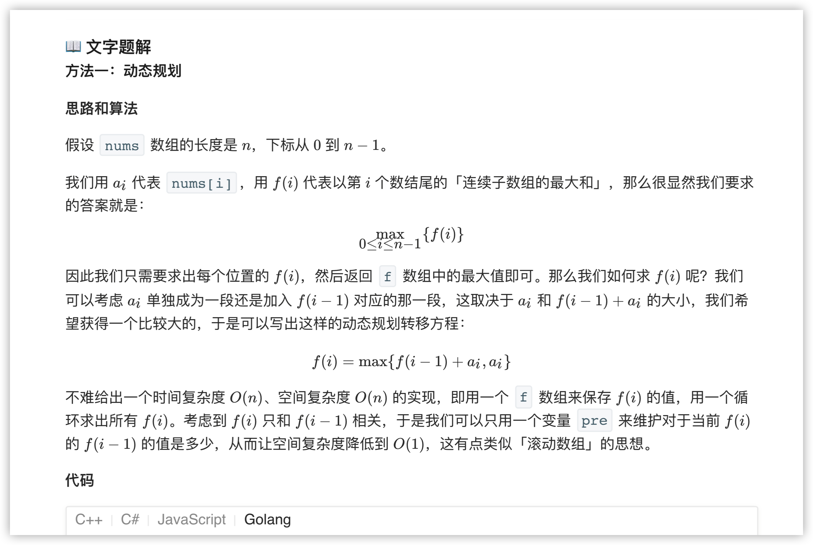
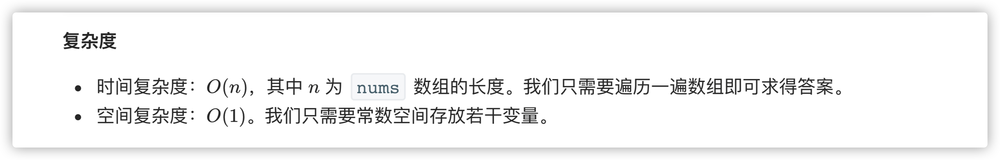
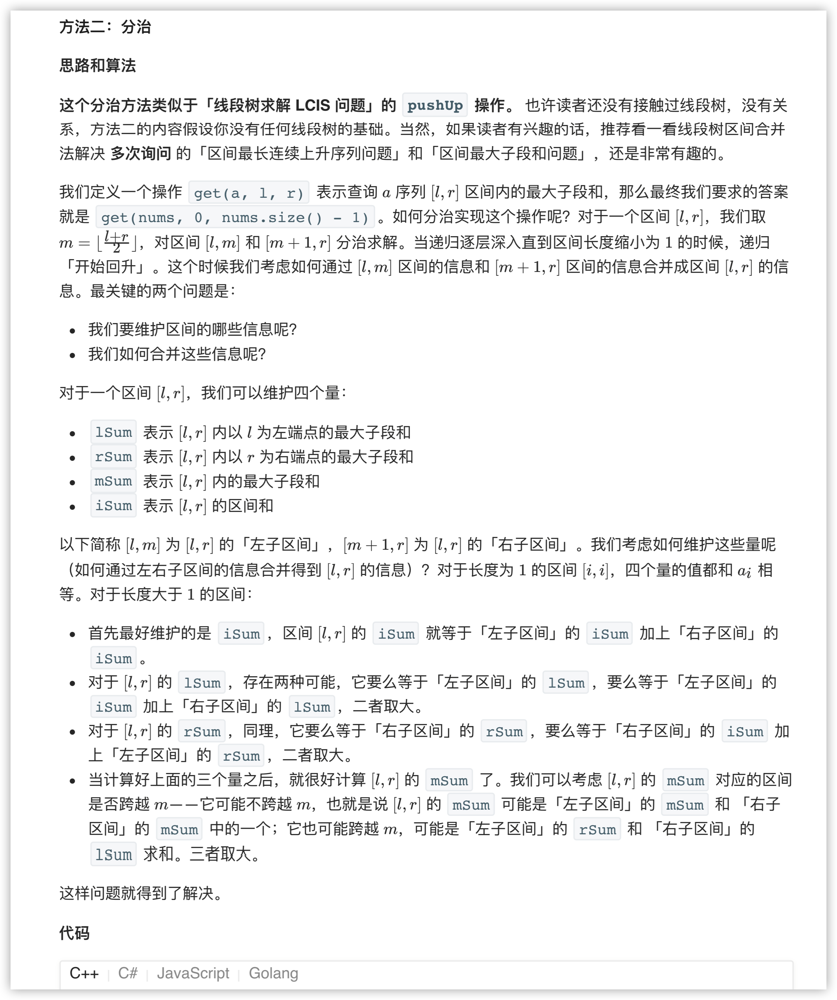
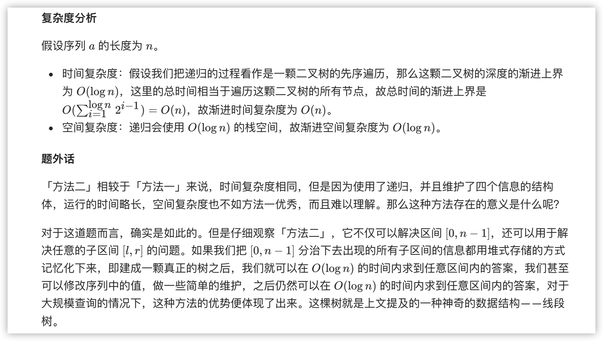

### 官方题解 [@link](https://leetcode-cn.com/problems/maximum-subarray/solution/zui-da-zi-xu-he-by-leetcode-solution/)


```Golang
func maxSubArray(nums []int) int {
    max := nums[0]
    for i := 1; i < len(nums); i++ {
        if nums[i] + nums[i-1] > nums[i] {
            nums[i] += nums[i-1]
        }
        if nums[i] > max {
            max = nums[i]
        }
    }
    return max
}
```


```Golang
func maxSubArray(nums []int) int {
    return get(nums, 0, len(nums) - 1).mSum;
}

func pushUp(l, r Status) Status {
    iSum := l.iSum + r.iSum
    lSum := max(l.lSum, l.iSum + r.lSum)
    rSum := max(r.rSum, r.iSum + l.rSum)
    mSum := max(max(l.mSum, r.mSum), l.rSum + r.lSum)
    return Status{lSum, rSum, mSum, iSum}
}

func get(nums []int, l, r int) Status {
    if (l == r) {
        return Status{nums[l], nums[l], nums[l], nums[l]}
    }
    m := (l + r) >> 1
    lSub := get(nums, l, m)
    rSub := get(nums, m + 1, r)
    return pushUp(lSub, rSub)
}

func max(x, y int) int {
    if x > y {
        return x
    }
    return y
}

type Status struct {
    lSum, rSum, mSum, iSum int
}
```
