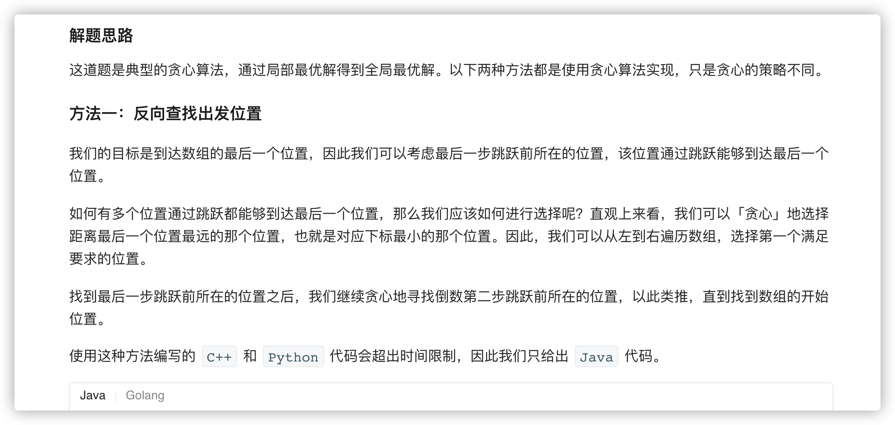
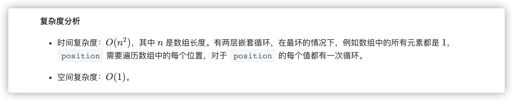
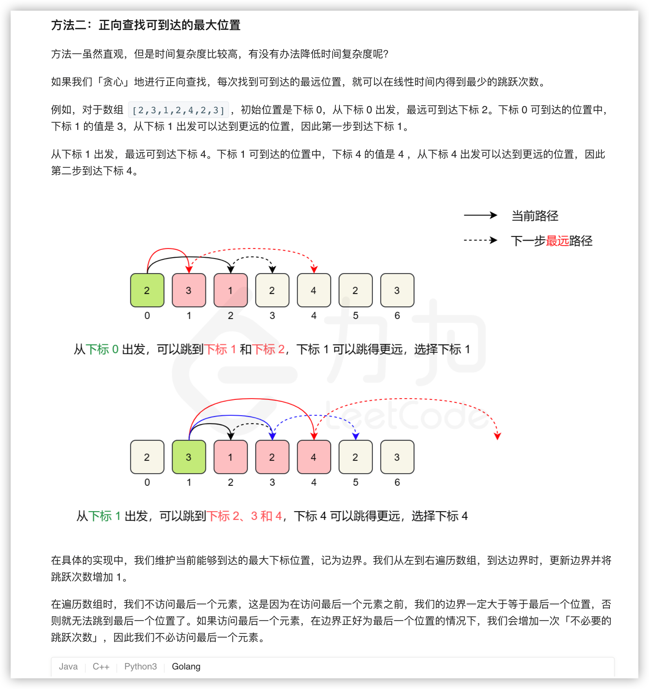

### 官方题解 [@link](https://leetcode-cn.com/problems/jump-game-ii/solution/tiao-yue-you-xi-ii-by-leetcode-solution/)


```Golang
func jump(nums []int) int {
    position := len(nums) - 1
    steps := 0
    for position > 0 {
        for i := 0; i < position; i++ {
            if i + nums[i] >= position {
                position = i
                steps++
                break
            }
        }
    }
    return steps
}
```


```Golang
func jump(nums []int) int {
    length := len(nums)
    end := 0
    maxPosition := 0
    steps := 0
    for i := 0; i < length - 1; i++ {
        maxPosition = max(maxPosition, i + nums[i])
        if i == end {
            end = maxPosition
            steps++
        }
    }
    return steps
}

func max(x, y int) int {
    if x > y {
        return x
    }
    return y
}
```
