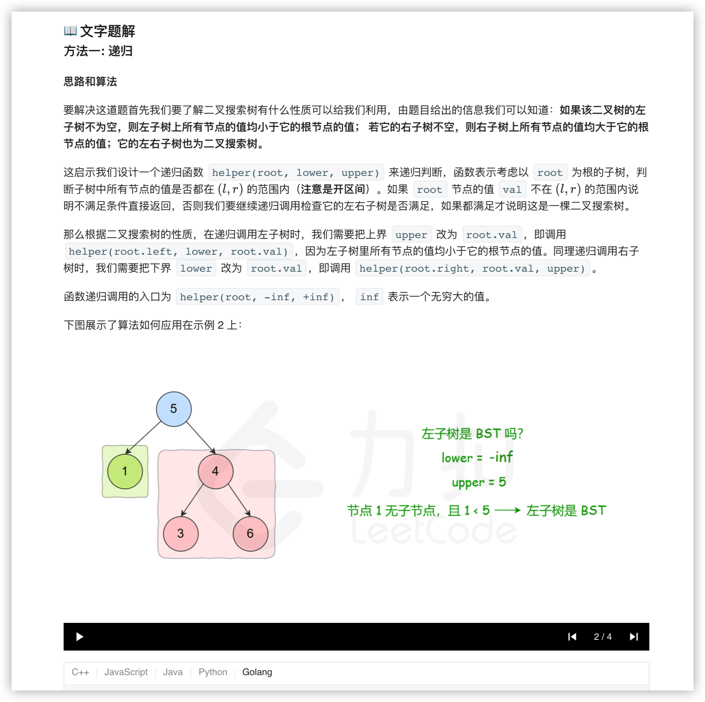
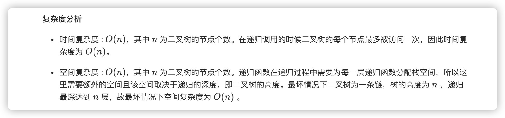
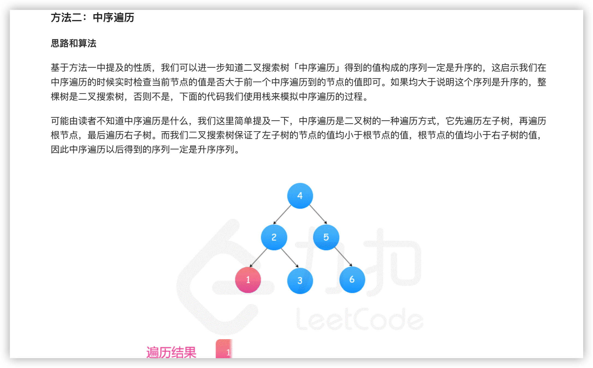
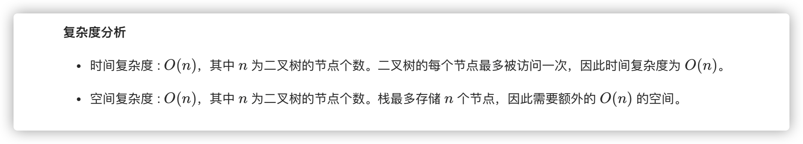

### 官方题解 [@link](https://leetcode-cn.com/problems/validate-binary-search-tree/solution/yan-zheng-er-cha-sou-suo-shu-by-leetcode-solution/)


```Golang
func isValidBST(root *TreeNode) bool {
    return helper(root, math.MinInt64, math.MaxInt64)
}

func helper(root *TreeNode, lower, upper int) bool {
    if root == nil {
        return true
    }
    if root.Val <= lower || root.Val >= upper {
        return false
    }
    return helper(root.Left, lower, root.Val) && helper(root.Right, root.Val, upper)
}
```


```Golang
func isValidBST(root *TreeNode) bool {
    stack := []*TreeNode{}
    inorder := math.MinInt64
    for len(stack) > 0 || root != nil {
        for root != nil {
            stack = append(stack, root)
            root = root.Left
        }
        root = stack[len(stack)-1]
        stack = stack[:len(stack)-1]
        if root.Val <= inorder {
            return false
        }
        inorder = root.Val
        root = root.Right
    }
    return true
}
```
