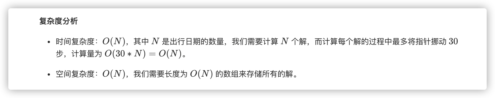

### 官方题解 [@link](https://leetcode-cn.com/problems/minimum-cost-for-tickets/solution/zui-di-piao-jie-by-leetcode-solution/)


```Golang
func mincostTickets(days []int, costs []int) int {
    memo := [366]int{}
    dayM := map[int]bool{}
    for _, d := range days {
        dayM[d] = true
    }

    var dp func(day int) int 
    dp = func(day int) int {
        if day > 365 {
            return 0
        }
        if memo[day] > 0 {
            return memo[day]
        }
        if dayM[day] {
            memo[day] = min(min(dp(day + 1) + costs[0], dp(day + 7) + costs[1]), dp(day + 30) + costs[2])
        } else {
            memo[day] = dp(day + 1)
        }
        return memo[day]
    }
    return dp(1)
}

func min(x, y int) int {
    if x < y {
        return x
    }
    return y
}
```


```Golang
func mincostTickets(days []int, costs []int) int {
    memo := [366]int{}
    durations := []int{1, 7, 30}

    var dp func(idx int) int 
    dp = func(idx int) int {
        if idx >= len(days) {
            return 0
        }
        if memo[idx] > 0 {
            return memo[idx]
        }
        memo[idx] = math.MaxInt32
        j := idx
        for i := 0; i < 3; i++ {
            for ; j < len(days) && days[j] < days[idx] + durations[i]; j++ { }
            memo[idx] = min(memo[idx], dp(j) + costs[i])
        }
        return memo[idx]
    }
    return dp(0)
}

func min(x, y int) int {
    if x < y {
        return x
    }
    return y
}
```
