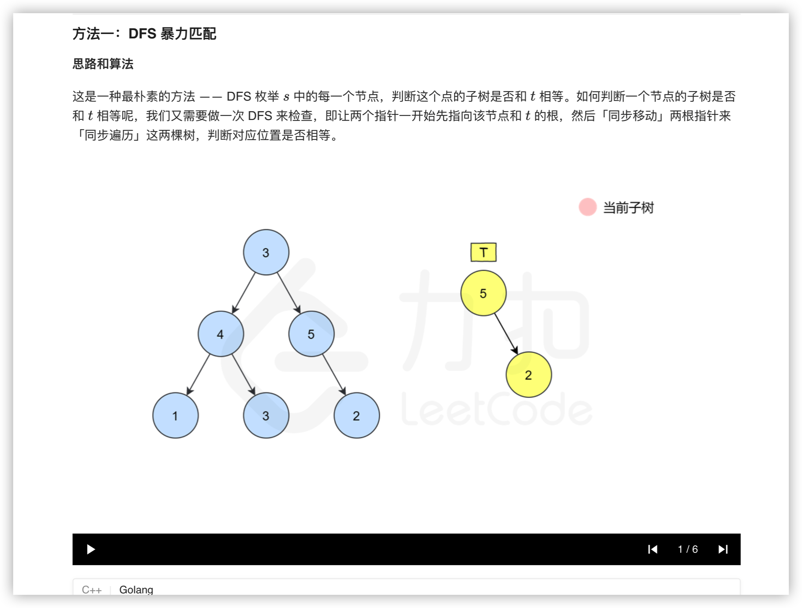
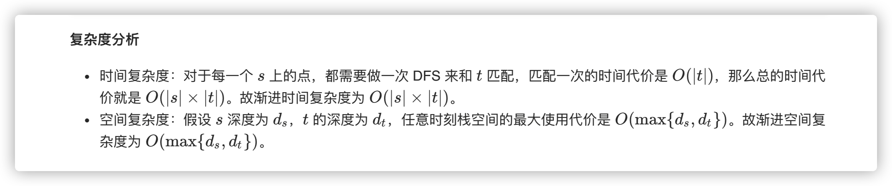
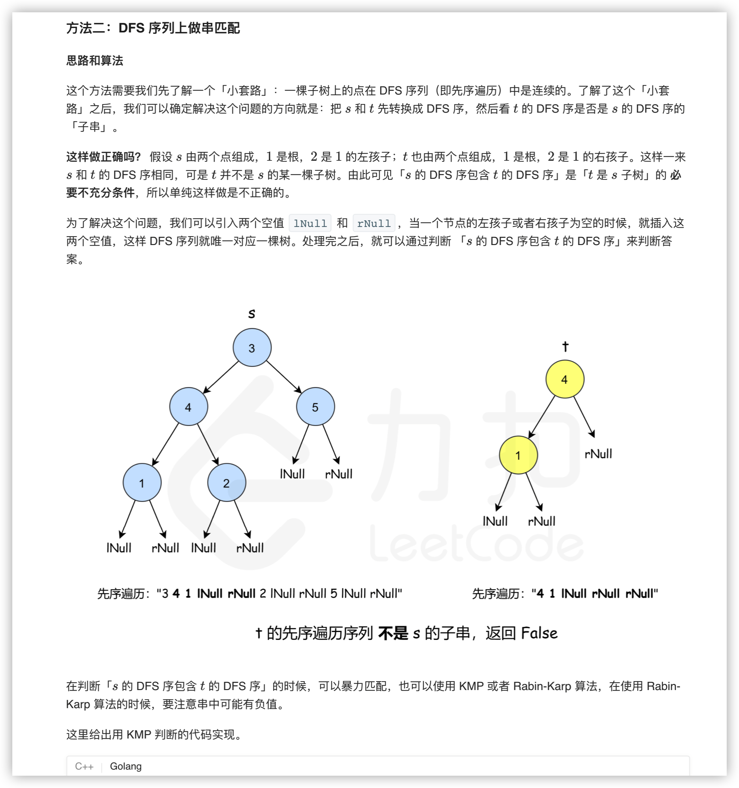
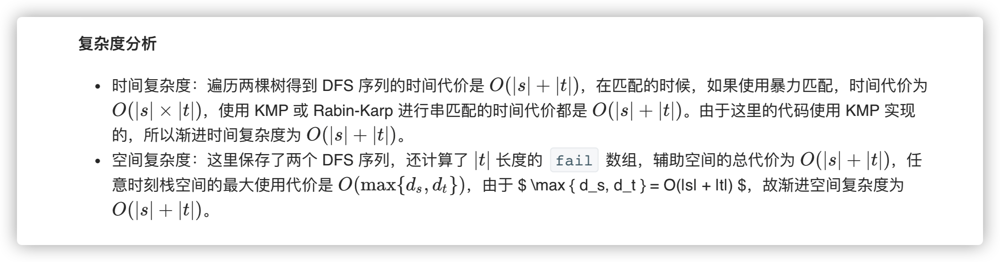
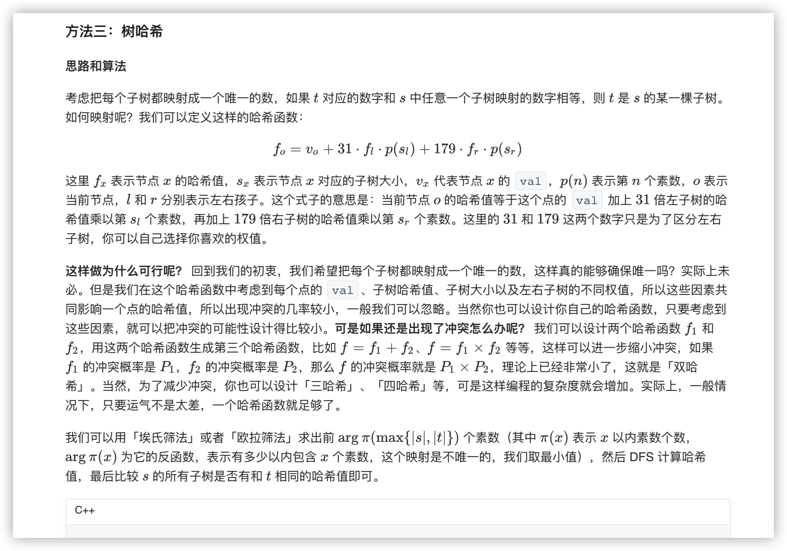
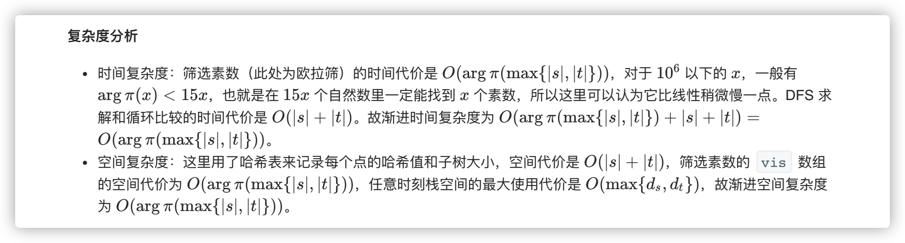

### 官方题解 [@link](https://leetcode-cn.com/problems/minimum-cost-for-tickets/solution/zui-di-piao-jie-by-leetcode-solution/)


```Golang
func isSubtree(s *TreeNode, t *TreeNode) bool {
    if s == nil {
        return false
    }
    return check(s, t) || isSubtree(s.Left, t) || isSubtree(s.Right, t)
}

func check(a, b *TreeNode) bool {
    if a == nil && b == nil {
        return true
    }
    if a == nil || b == nil {
        return false
    }
    if a.Val == b.Val {
        return check(a.Left, b.Left) && check(a.Right, b.Right)
    }
    return false
}
```


```Golang
func isSubtree(s *TreeNode, t *TreeNode) bool {
    maxEle := math.MinInt32
    getMaxElement(s, &maxEle)
    getMaxElement(t, &maxEle)
    lNull := maxEle + 1;
    rNull := maxEle + 2;

    sl, tl := getDfsOrder(s, []int{}, lNull, rNull), getDfsOrder(t, []int{}, lNull, rNull)
    return kmp(sl, tl)
}

func kmp(s, t []int) bool {
    sLen, tLen := len(s), len(t)
    fail := make([]int, sLen)
    for i := 0; i < sLen; i++ {
        fail[i] = -1
    }
    for i, j := 1, -1; i < tLen; i++ {
        for j != -1 && t[i] != t[j+1] {
            j = fail[j]
        }
        if t[i] == t[j+1] {
            j++
        }
        fail[i] = j
    }

    for i, j := 0, -1; i < sLen; i++ {
        for j != -1 && s[i] != t[j+1] {
            j = fail[j]
        }
        if s[i] == t[j+1] {
            j++
        }
        if j == tLen - 1 {
            return true
        }
    }
    return false
}

func getDfsOrder(t *TreeNode, list []int, lNull, rNull int) []int {
    if t == nil {
        return list
    }
    list = append(list, t.Val)
    if t.Left != nil {
        list = getDfsOrder(t.Left, list, lNull, rNull)
    } else {
        list = append(list, lNull)
    }

    if t.Right != nil {
        list = getDfsOrder(t.Right, list, lNull, rNull)
    } else {
        list = append(list, rNull)
    }
    return list
} 

func getMaxElement(t *TreeNode, maxEle *int) {
    if t == nil {
        return
    }
    if t.Val > *maxEle {
        *maxEle = t.Val
    }
    getMaxElement(t.Left, maxEle)
    getMaxElement(t.Right, maxEle)
}
```


```C++
class Solution {
public:
    static constexpr int MAX_N = 1000 + 5;
    static constexpr int MOD = int(1E9) + 7;

    bool vis[MAX_N];
    int p[MAX_N], tot;
    void getPrime() {
        vis[0] = vis[1] = 1; tot = 0;
        for (int i = 2; i < MAX_N; ++i) {
            if (!vis[i]) p[++tot] = i;
            for (int j = 1; j <= tot && i * p[j] < MAX_N; ++j) {
                vis[i * p[j]] = 1;
                if (i % p[j] == 0) break;
            }
        }
    }

    struct Status {
        int f, s; // f 为哈希值 | s 为子树大小
        Status(int f_ = 0, int s_ = 0) 
            : f(f_), s(s_) {}
    };

    unordered_map <TreeNode *, Status> hS, hT;

    void dfs(TreeNode *o, unordered_map <TreeNode *, Status> &h) {
        h[o] = Status(o->val, 1);
        if (!o->left && !o->right) return;
        if (o->left) {
            dfs(o->left, h);
            h[o].s += h[o->left].s;
            h[o].f = (h[o].f + (31LL * h[o->left].f * p[h[o->left].s]) % MOD) % MOD;
        }
        if (o->right) {
            dfs(o->right, h);
            h[o].s += h[o->right].s;
            h[o].f = (h[o].f + (179LL * h[o->right].f * p[h[o->right].s]) % MOD) % MOD;
        }
    }

    bool isSubtree(TreeNode* s, TreeNode* t) {
        getPrime();
        dfs(s, hS);
        dfs(t, hT);

        int tHash = hT[t].f;
        for (const auto &[k, v]: hS) {
            if (v.f == tHash) {
                return true;
            }
        } 

        return false;
    }
};
```
