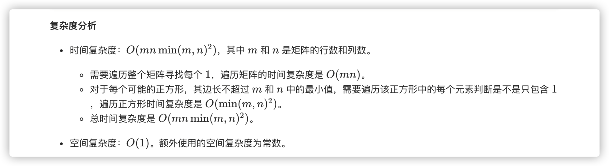

### 官方题解 [@link](https://leetcode-cn.com/problems/maximal-square/solution/zui-da-zheng-fang-xing-by-leetcode-solution/)


```Golang
func maximalSquare(matrix [][]byte) int {
    maxSide := 0
    if len(matrix) == 0 || len(matrix[0]) == 0 {
        return maxSide
    }
    rows, columns := len(matrix), len(matrix[0])
    for i := 0; i < rows; i++ {
        for j := 0; j < columns; j++ {
            if matrix[i][j] == '1' {
                maxSide = max(maxSide, 1)
                curMaxSide := min(rows - i, columns - j)
                for k := 1; k < curMaxSide; k++ {
                    flag := true
                    if matrix[i+k][j+k] == '0' {
                        break
                    }
                    for m := 0; m < k; m++ {
                        if matrix[i+k][j+m] == '0' || matrix[i+m][j+k] == '0' {
                            flag = false
                            break
                        }
                    }
                    if flag {
                        maxSide = max(maxSide, k + 1)
                    } else {
                        break
                    }
                }
            }
        }
    }
    return maxSide * maxSide
}

func max(x, y int) int {
    if x > y {
        return x
    }
    return y
}

func min(x, y int) int {
    if x < y {
        return x
    }
    return y
}
```


```Golang
func maximalSquare(matrix [][]byte) int {
    dp := make([][]int, len(matrix))
    maxSide := 0
    for i := 0; i < len(matrix); i++ {
        dp[i] = make([]int, len(matrix[i]))
        for j := 0; j < len(matrix[i]); j++ {
            dp[i][j] = int(matrix[i][j] - '0')
            if dp[i][j] == 1 {
                maxSide = 1
            }
        }
    }

    for i := 1; i < len(matrix); i++ {
        for j := 1; j < len(matrix[i]); j++ {
            if dp[i][j] == 1 {
                dp[i][j] = min(min(dp[i-1][j], dp[i][j-1]), dp[i-1][j-1]) + 1
                if dp[i][j] > maxSide {
                    maxSide = dp[i][j]
                }
            }
        }
    }
    return maxSide * maxSide
}

func min(x, y int) int {
    if x < y {
        return x
    }
    return y
}
```
