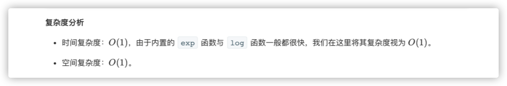

### 官方题解 [@link](https://leetcode-cn.com/problems/sqrtx/solution/x-de-ping-fang-gen-by-leetcode-solution/)


```Golang
func mySqrt(x int) int {
    if x == 0 {
        return 0
    }
    ans := int(math.Exp(0.5 * math.Log(float64(x))))
    if (ans + 1) * (ans + 1) <= x {
        return ans + 1
    }
    return ans
}
```


```Golang
func mySqrt(x int) int {
    l, r := 0, x
    ans := -1
    for l <= r {
        mid := l + (r - l) / 2
        if mid * mid <= x {
            ans = mid
            l = mid + 1
        } else {
            r = mid - 1
        }
    }
    return ans
}
```


```Golang
func mySqrt(x int) int {
    if x == 0 {
        return 0
    }
    C, x0 := float64(x), float64(x)
    for {
        xi := 0.5 * (x0 + C/x0)
        if math.Abs(x0 - xi) < 1e-7 {
            break
        }
        x0 = xi
    }
    return int(x0)
}
```
