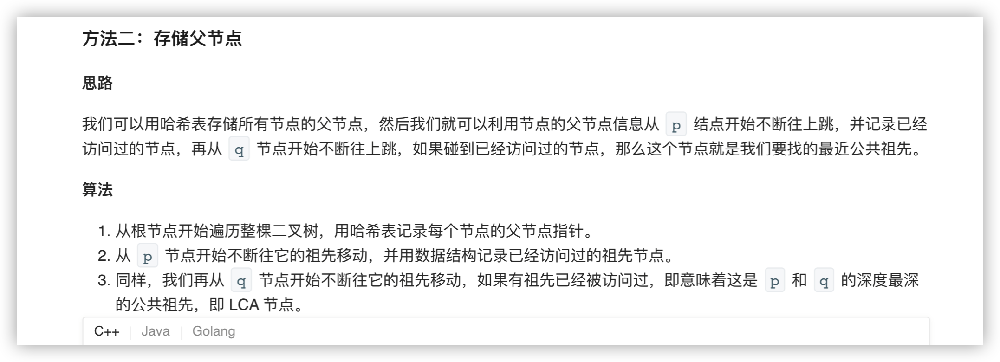

### 官方题解 [@link](https://leetcode-cn.com/problems/lowest-common-ancestor-of-a-binary-tree/solution/er-cha-shu-de-zui-jin-gong-gong-zu-xian-by-leetc-2/)


```Golang
func lowestCommonAncestor(root, p, q *TreeNode) *TreeNode {
    if root == nil {
        return nil
    }
    if root.Val == p.Val || root.Val == q.Val {
        return root
    }
    left := lowestCommonAncestor(root.Left, p, q)
    right := lowestCommonAncestor(root.Right, p, q)
    if left != nil && right != nil {
        return root
    }
    if left == nil {
        return right
    }
    return left
}
```


```Golang
func lowestCommonAncestor(root, p, q *TreeNode) *TreeNode {
    parent := map[int]*TreeNode{}
    visited := map[int]bool{}

    var dfs func(*TreeNode)
    dfs = func(r *TreeNode) {
        if r == nil {
            return
        }
        if r.Left != nil {
            parent[r.Left.Val] = r
            dfs(r.Left)
        }
        if r.Right != nil {
            parent[r.Right.Val] = r
            dfs(r.Right)
        }
    }
    dfs(root)

    for p != nil {
        visited[p.Val] = true
        p = parent[p.Val]
    }
    for q != nil {
        if visited[q.Val] {
            return q
        }
        q = parent[q.Val]
    }

    return nil
}
```
