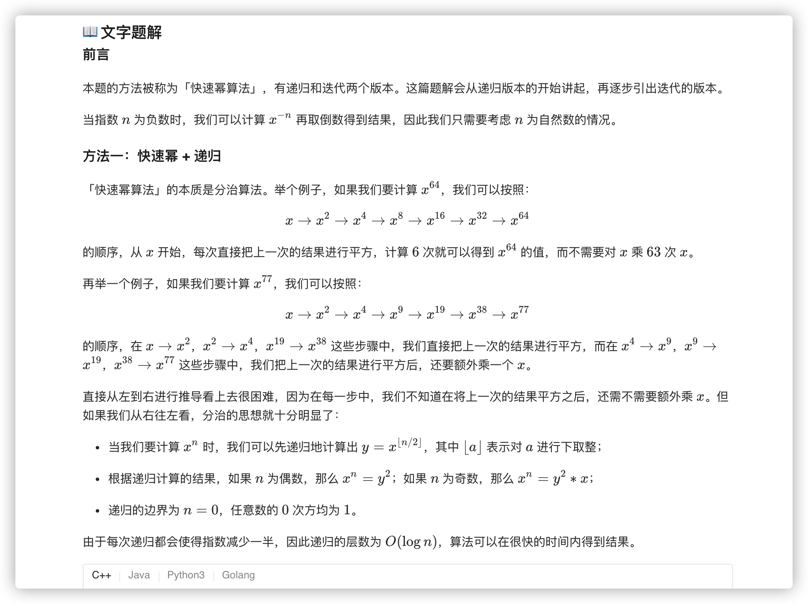
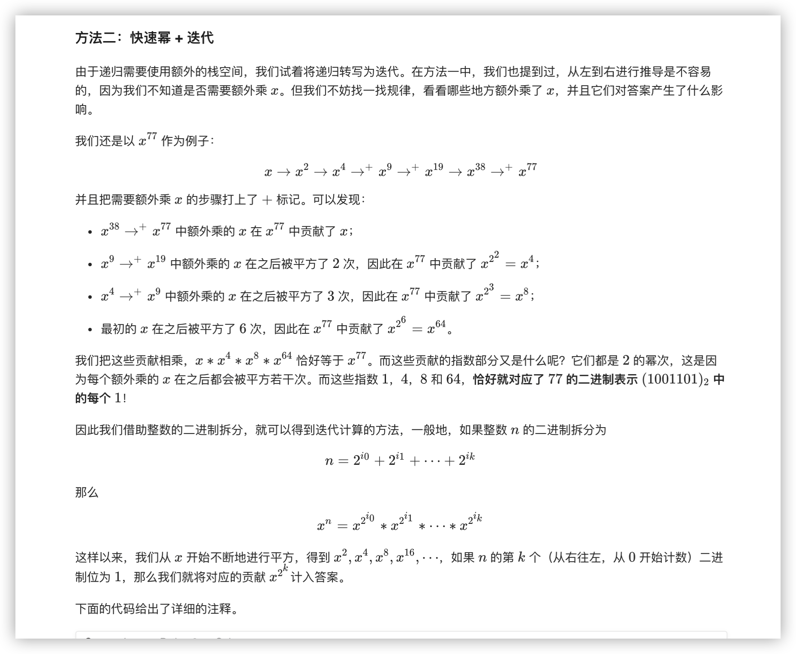

### 官方题解 [@link](https://leetcode-cn.com/problems/powx-n/solution/powx-n-by-leetcode-solution/)


```Golang
func myPow(x float64, n int) float64 {
    if n >= 0 {
        return quickMul(x, n)
    }
    return 1.0 / quickMul(x, -n)
}

func quickMul(x float64, n int) float64 {
    if n == 0 {
        return 1
    }
    y := quickMul(x, n/2)
    if n%2 == 0 {
        return y * y
    }
    return y * y * x
}
```


```Golang
func myPow(x float64, n int) float64 {
    if n >= 0 {
        return quickMul(x, n)
    }
    return 1.0 / quickMul(x, -n)
}

func quickMul(x float64, N int) float64 {
    ans := 1.0
    // 贡献的初始值为 x
    x_contribute := x
    // 在对 N 进行二进制拆分的同时计算答案
    for N > 0 {
        if N % 2 == 1 {
            // 如果 N 二进制表示的最低位为 1，那么需要计入贡献
            ans *= x_contribute
        }
        // 将贡献不断地平方
        x_contribute *= x_contribute
        // 舍弃 N 二进制表示的最低位，这样我们每次只要判断最低位即可
        N /= 2
    }
    return ans
}
```
