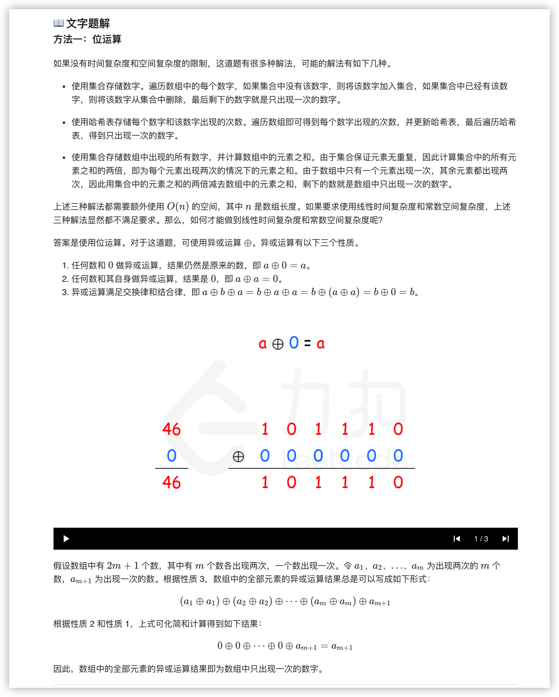
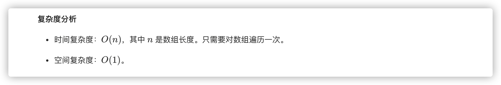

### 官方题解 [@link](https://leetcode-cn.com/problems/single-number/solution/zhi-chu-xian-yi-ci-de-shu-zi-by-leetcode-solution/)


```Golang
func singleNumber(nums []int) int {
    single := 0
    for _, num := range nums {
        single ^= num
    }
    return single
}
```
