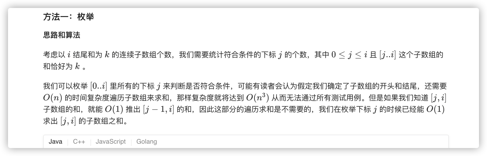
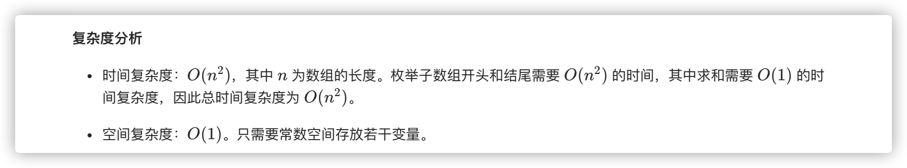
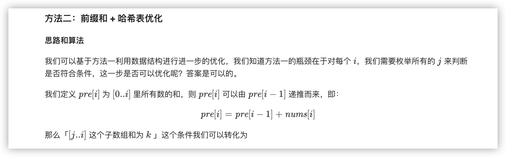
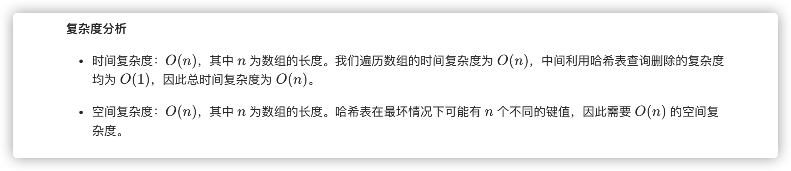

### 官方题解 [@link](https://leetcode-cn.com/problems/subarray-sum-equals-k/solution/he-wei-kde-zi-shu-zu-by-leetcode-solution/)


```Golang
public class Solution {
    public int subarraySum(int[] nums, int k) {
        int count = 0;
        for (int start = 0; start < nums.length; ++start) {
            int sum = 0;
            for (int end = start; end >= 0; --end) {
                sum += nums[end];
                if (sum == k) {
                    count++;
                }
            }
        }
        return count;
    }
}
```


```Golang
func subarraySum(nums []int, k int) int {
    count, pre := 0, 0
    m := map[int]int{}
    m[0] = 1
    for i := 0; i < len(nums); i++ {
        pre += nums[i]
        if _, ok := m[pre - k]; ok {
            count += m[pre - k]
        }
        m[pre] += 1
    }
    return count
}
```
