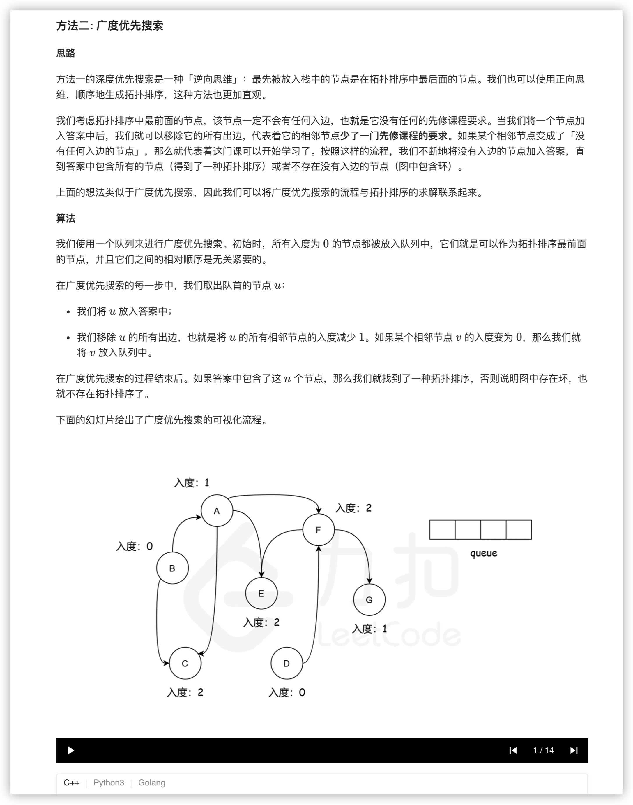

### 官方题解 [@link](https://leetcode-cn.com/problems/course-schedule-ii/solution/ke-cheng-biao-ii-by-leetcode-solution/)


```Golang
func findOrder(numCourses int, prerequisites [][]int) []int {
    var (
        edges = make([][]int, numCourses)
        visited = make([]int, numCourses)
        result []int
        invalid bool
        dfs func(u int)
    )

    dfs = func(u int) {
        visited[u] = 1
        for _, v := range edges[u] {
            if visited[v] == 0 {
                dfs(v)
                if invalid {
                    return
                }
            } else if visited[v] == 1 {
                invalid = true
                return
            }
        }
        visited[u] = 2
        result = append(result, u)
    }

    for _, info := range prerequisites {
        edges[info[1]] = append(edges[info[1]], info[0])
    }

    for i := 0; i < numCourses && !invalid; i++ {
        if visited[i] == 0 {
            dfs(i)
        }
    }
    if invalid {
        return []int{}
    }
    for i := 0; i < len(result)/2; i ++ {
        result[i], result[numCourses-i-1] = result[numCourses-i-1], result[i]
    }
    return result
}
```


```Golang
func findOrder(numCourses int, prerequisites [][]int) []int {
    var (
        edges = make([][]int, numCourses)
        indeg = make([]int, numCourses)
        result []int
    )

    for _, info := range prerequisites {
        edges[info[1]] = append(edges[info[1]], info[0])
        indeg[info[0]]++
    }

    q := []int{}
    for i := 0; i < numCourses; i++ {
        if indeg[i] == 0 {
            q = append(q, i)
        }
    }

    for len(q) > 0 {
        u := q[0]
        q = q[1:]
        result = append(result, u)
        for _, v := range edges[u] {
            indeg[v]--
            if indeg[v] == 0 {
                q = append(q, v)
            }
        }
    }
    if len(result) != numCourses {
        return []int{}
    }
    return result
}
```
