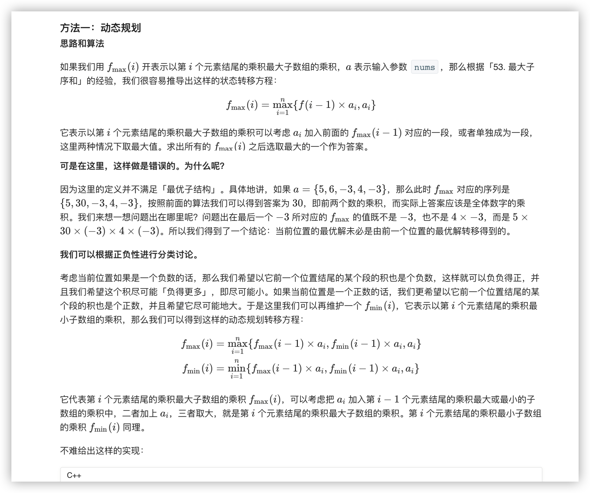
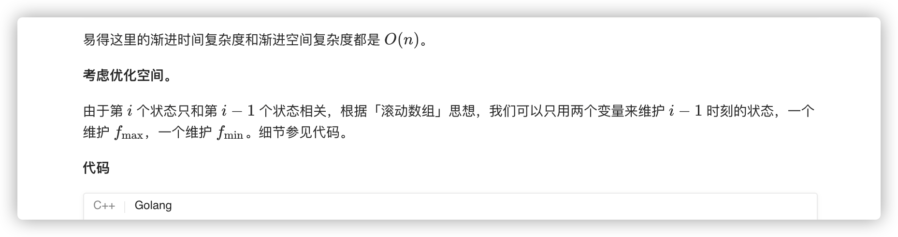
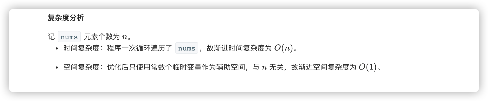

### 官方题解 [@link](https://leetcode-cn.com/problems/maximum-product-subarray/solution/cheng-ji-zui-da-zi-shu-zu-by-leetcode-solution/)


```C++
class Solution {
public:
    int maxProduct(vector<int>& nums) {
        vector <int> maxF(nums), minF(nums);
        for (int i = 1; i < nums.size(); ++i) {
            maxF[i] = max(maxF[i - 1] * nums[i], max(nums[i], minF[i - 1] * nums[i]));
            minF[i] = min(minF[i - 1] * nums[i], min(nums[i], maxF[i - 1] * nums[i]));
        }
        return *max_element(maxF.begin(), maxF.end());
    }
};
```

```Golang
func maxProduct(nums []int) int {
    maxF, minF, ans := nums[0], nums[0], nums[0]
    for i := 1; i < len(nums); i++ {
        mx, mn := maxF, minF
        maxF = max(mx * nums[i], max(nums[i], mn * nums[i]))
        minF = min(mn * nums[i], min(nums[i], mx * nums[i]))
        ans = max(maxF, ans)
    }
    return ans
}

func max(x, y int) int {
    if x > y {
        return x
    }
    return y
}

func min(x, y int) int {
    if x < y {
        return x
    }
    return y
}
```
