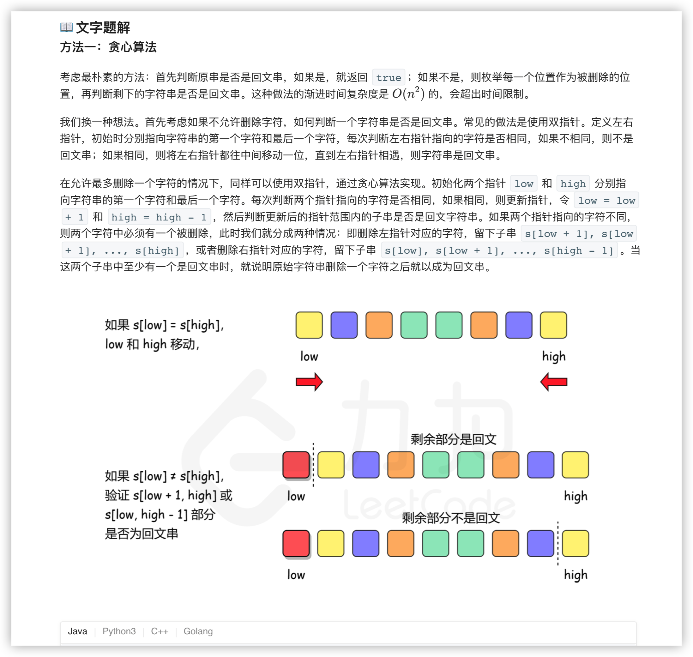
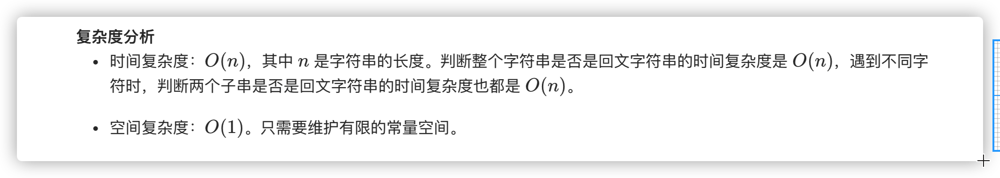

### 官方题解 [@link](https://leetcode-cn.com/problems/valid-palindrome-ii/solution/yan-zheng-hui-wen-zi-fu-chuan-ii-by-leetcode-solut/)


```Golang
func validPalindrome(s string) bool {
    low, high := 0, len(s) - 1
    for low < high {
        if s[low] == s[high] {
            low++
            high--
        } else {
            flag1, flag2 := true, true
            for i, j := low, high - 1; i < j; i, j = i + 1, j - 1 {
                if s[i] != s[j] {
                    flag1 = false
                    break
                }
            }
            for i, j := low + 1, high; i < j; i, j = i + 1, j - 1 {
                if s[i] != s[j] {
                    flag2 = false
                    break
                }
            }
            return flag1 || flag2
        }
    }
    return true
}
```
