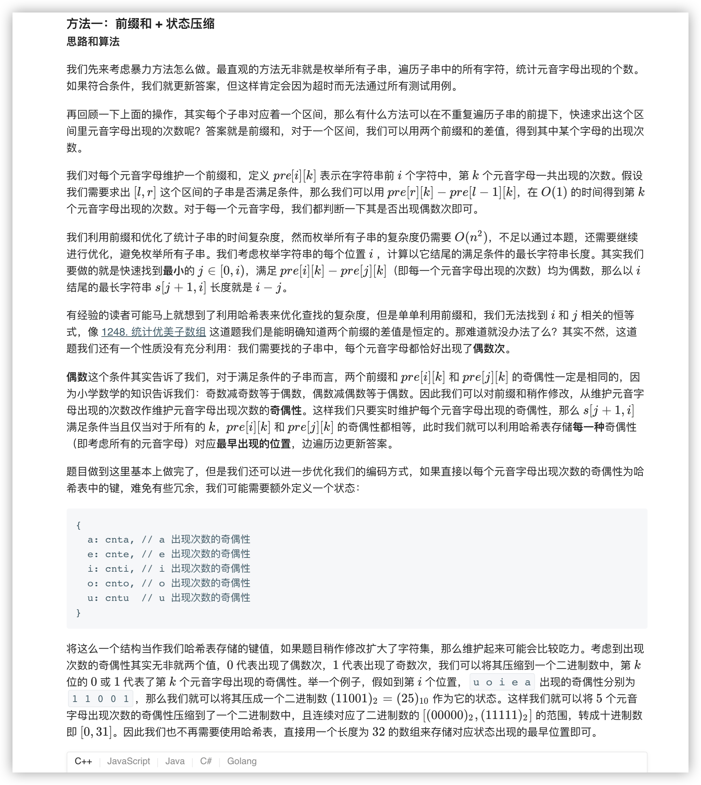
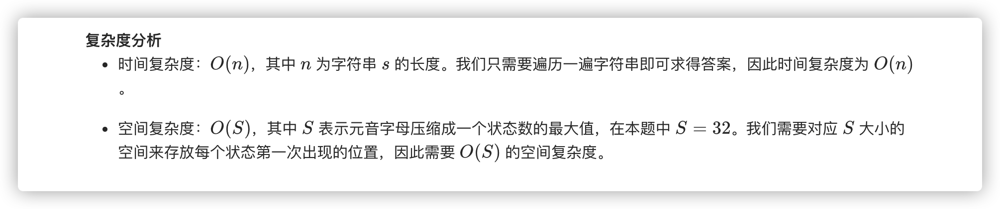

### 官方题解 [@link](https://leetcode-cn.com/problems/find-the-longest-substring-containing-vowels-in-even-counts/solution/mei-ge-yuan-yin-bao-han-ou-shu-ci-de-zui-chang-z-2/)


```Golang
func findTheLongestSubstring(s string) int {
    ans, status := 0, 0
    pos := make([]int, 1 << 5)
    for i := 0; i < len(pos); i++ {
        pos[i] = -1
    }
    pos[0] = 0
    for i := 0; i < len(s); i++ {
        switch s[i] {
        case 'a':
            status ^= 1 << 0
        case 'e':
            status ^= 1 << 1
        case 'i':
            status ^= 1 << 2
        case 'o':
            status ^= 1 << 3
        case 'u':
            status ^= 1 << 4
        }
        if pos[status] >= 0 {
            ans = Max(ans, i + 1 - pos[status])
        } else {
            pos[status] = i + 1
        }
    }
    return ans
}

func Max(x, y int) int {
    if x > y {
        return x
    }
    return y
}
```
