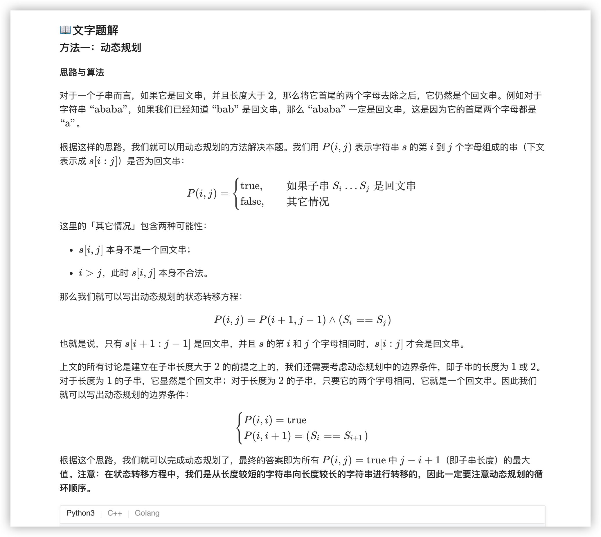
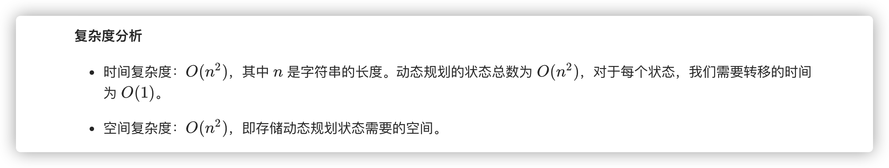
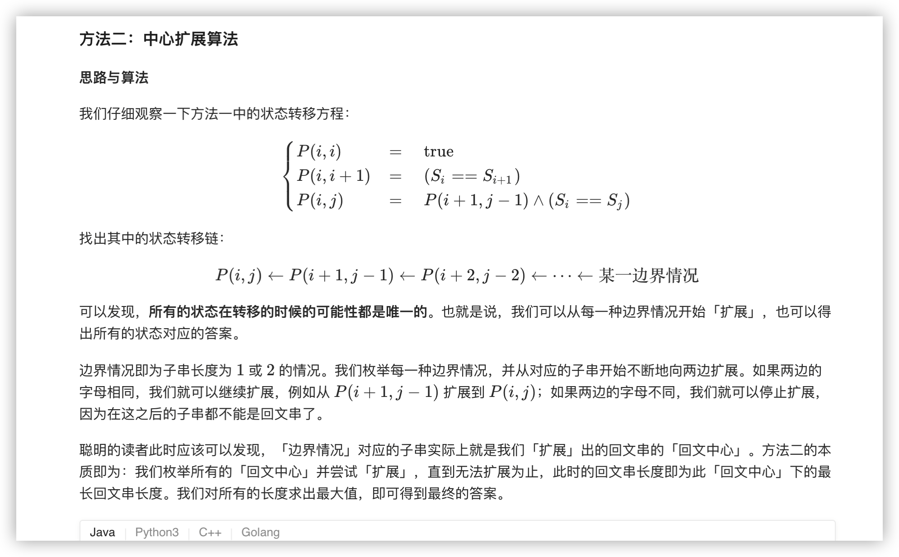
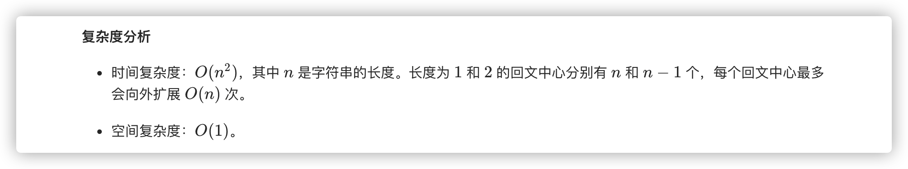
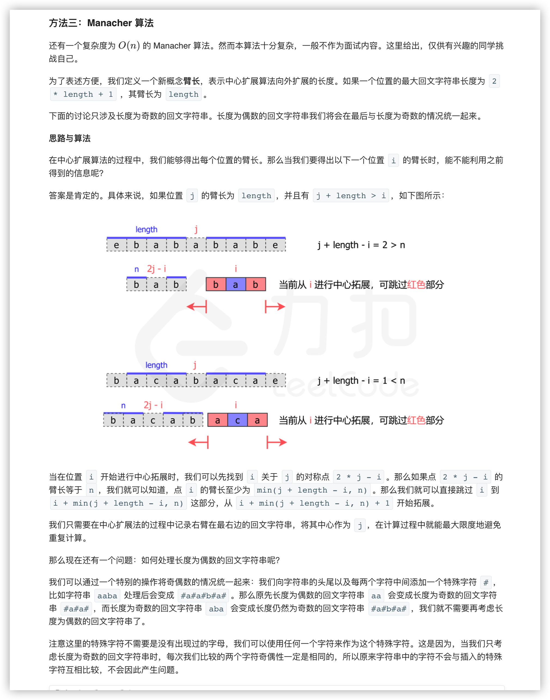
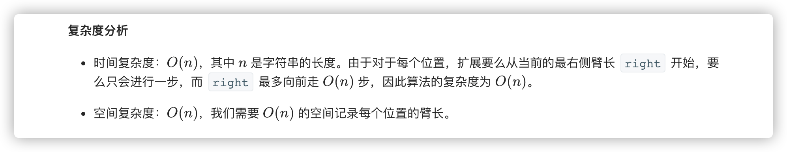

### 官方题解 [@link](https://leetcode-cn.com/problems/longest-palindromic-substring/solution/zui-chang-hui-wen-zi-chuan-by-leetcode-solution/)


```Golang
func longestPalindrome(s string) string {
    n := len(s)
    ans := ""
    dp := make([][]int, n)
    for i := 0; i < n; i++ {
        dp[i] = make([]int, n)
    }
    for l := 0; l < n; l++ {
        for i := 0; i + l < n; i++ {
            j := i + l
            if l == 0 {
                dp[i][j] = 1
            } else if l == 1 {
                if s[i] == s[j] {
                    dp[i][j] = 1
                }
            } else {
                if s[i] == s[j] {
                    dp[i][j] = dp[i+1][j-1]
                }
            }
            if dp[i][j] > 0 && l + 1 > len(ans) {
                ans = s[i:i+l+1]
            }
        }
    }
    return ans
}
```


```Golang
func longestPalindrome(s string) string {
    if s == "" {
        return ""
    }
    start, end := 0, 0
    for i := 0; i < len(s); i++ {
        left1, right1 := expandAroundCenter(s, i, i)
        left2, right2 := expandAroundCenter(s, i, i + 1)
        if right1 - left1 > end - start {
            start, end = left1, right1
        }
        if right2 - left2 > end - start {
            start, end = left2, right2
        }
    }
    return s[start:end+1]
}

func expandAroundCenter(s string, left, right int) (int, int) {
    for ; left >= 0 && right < len(s) && s[left] == s[right]; left, right = left-1 , right+1 { }
    return left + 1, right - 1
}
```


```Golang
func longestPalindrome(s string) string {
    start, end := 0, -1
    t := "#"
    for i := 0; i < len(s); i++ {
        t += string(s[i]) + "#"
    }
    t += "#"
    s = t
    arm_len := []int{}
    right, j := -1, -1
    for i := 0; i < len(s); i++ {
        var cur_arm_len int
        if right >= i {
            i_sym := j * 2 - i
            min_arm_len := min(arm_len[i_sym], right-i)
            cur_arm_len = expand(s, i-min_arm_len, i+min_arm_len)
        } else {
            cur_arm_len = expand(s, i, i)
        }
        arm_len = append(arm_len, cur_arm_len)
        if i + cur_arm_len > right {
            j = i
            right = i + cur_arm_len
        }
        if cur_arm_len * 2 + 1 > end - start {
            start = i - cur_arm_len
            end = i + cur_arm_len
        }
    }
    ans := ""
    for i := start; i <= end; i++ {
        if s[i] != '#' {
            ans += string(s[i])
        }
    }
    return ans
}

func expand(s string, left, right int) int {
    for ; left >= 0 && right < len(s) && s[left] == s[right]; left, right = left-1, right+1 { }
    return (right - left - 2) / 2
}

func min(x, y int) int {
    if x < y {
        return x
    }
    return y
}
```
