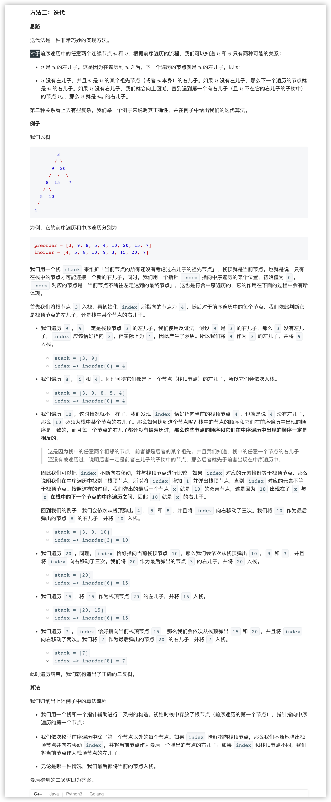

### 官方题解 [@link](https://leetcode-cn.com/problems/construct-binary-tree-from-preorder-and-inorder-traversal/solution/cong-qian-xu-yu-zhong-xu-bian-li-xu-lie-gou-zao-9/)


```Golang
func buildTree(preorder []int, inorder []int) *TreeNode {
    if len(preorder) == 0 {
        return nil
    }
    root := &TreeNode{preorder[0], nil, nil}
    i := 0
    for ; i < len(inorder); i++ {
        if inorder[i] == preorder[0] {
            break
        }
    }
    root.Left = buildTree(preorder[1:len(inorder[:i])+1], inorder[:i])
    root.Right = buildTree(preorder[len(inorder[:i])+1:], inorder[i+1:])
    return root
}
```


```Golang
func buildTree(preorder []int, inorder []int) *TreeNode {
    if len(preorder) == 0 {
        return nil
    }
    root := &TreeNode{preorder[0], nil, nil}
    stack := []*TreeNode{}
    stack = append(stack, root)
    var inorderIndex int
    for i := 1; i < len(preorder); i++ {
        preorderVal := preorder[i]
        node := stack[len(stack)-1]
        if node.Val != inorder[inorderIndex] {
            node.Left = &TreeNode{preorderVal, nil, nil}
            stack = append(stack, node.Left)
        } else {
            for len(stack) != 0 && stack[len(stack)-1].Val == inorder[inorderIndex] {
                node = stack[len(stack)-1]
                stack = stack[:len(stack)-1]
                inorderIndex++
            }
            node.Right = &TreeNode{preorderVal, nil, nil}
            stack = append(stack, node.Right)
        }
    }
    return root
}
```
