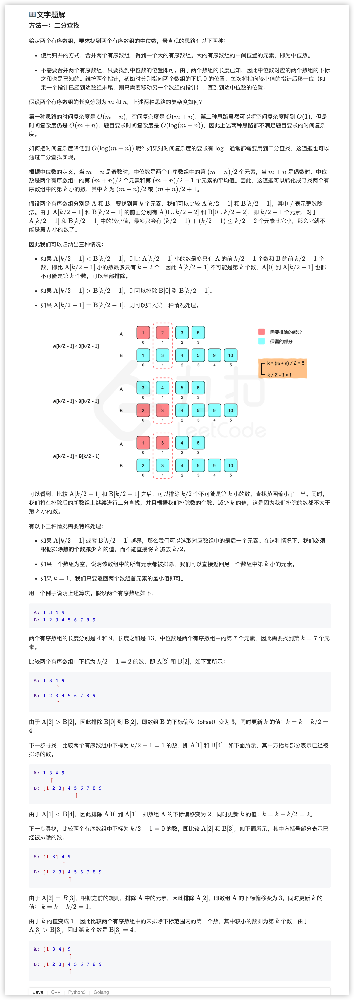

### 官方题解 [@link](https://leetcode-cn.com/problems/median-of-two-sorted-arrays/solution/xun-zhao-liang-ge-you-xu-shu-zu-de-zhong-wei-s-114/)


```Golang
func findMedianSortedArrays(nums1 []int, nums2 []int) float64 {
    totalLength := len(nums1) + len(nums2)
    if totalLength%2 == 1 {
        midIndex := totalLength/2
        return float64(getKthElement(nums1, nums2, midIndex + 1))
    } else {
        midIndex1, midIndex2 := totalLength/2 - 1, totalLength/2
        return float64(getKthElement(nums1, nums2, midIndex1 + 1) + getKthElement(nums1, nums2, midIndex2 + 1)) / 2.0
    }
    return 0
}

func getKthElement(nums1, nums2 []int, k int) int {
    index1, index2 := 0, 0
    for {
        if index1 == len(nums1) {
            return nums2[index2 + k - 1]
        }
        if index2 == len(nums2) {
            return nums1[index1 + k - 1]
        }
        if k == 1 {
            return min(nums1[index1], nums2[index2])
        }
        half := k/2
        newIndex1 := min(index1 + half, len(nums1)) - 1
        newIndex2 := min(index2 + half, len(nums2)) - 1
        pivot1, pivot2 := nums1[newIndex1], nums2[newIndex2]
        if pivot1 <= pivot2 {
            k -= (newIndex1 - index1 + 1)
            index1 = newIndex1 + 1
        } else {
            k -= (newIndex2 - index2 + 1)
            index2 = newIndex2 + 1
        }
    }
    return 0
}

func min(x, y int) int {
    if x < y {
        return x
    }
    return y
}
```


```Golang
func findMedianSortedArrays(nums1 []int, nums2 []int) float64 {
    if len(nums1) > len(nums2) {
        return findMedianSortedArrays(nums2, nums1)
    }
    m, n := len(nums1), len(nums2)
    left, right := 0, m
    median1, median2 := 0, 0
    for left <= right {
        i := (left + right) / 2
        j := (m + n + 1) / 2 - i
        nums_im1 := math.MinInt32
        if i != 0 {
            nums_im1 = nums1[i-1]
        }
        nums_i := math.MaxInt32
        if i != m {
            nums_i = nums1[i]
        }
        nums_jm1 := math.MinInt32
        if j != 0 {
            nums_jm1 = nums2[j-1]
        }
        nums_j := math.MaxInt32
        if j != n {
            nums_j = nums2[j]
        }
        if nums_im1 <= nums_j {
            median1 = max(nums_im1, nums_jm1)
            median2 = min(nums_i, nums_j)
            left = i + 1
        } else {
            right = i - 1
        }
    }
    if (m + n) % 2 == 0 {
        return float64(median1 + median2) / 2.0
    }
    return  float64(median1)
}

func max(x, y int) int {
    if x > y {
        return x
    }
    return y
}

func min(x, y int) int {
    if x < y {
        return x
    }
    return y
}
```
