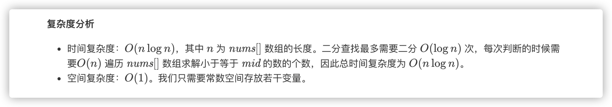

### 官方题解 [@link](https://leetcode-cn.com/problems/find-the-duplicate-number/solution/xun-zhao-zhong-fu-shu-by-leetcode-solution/)


```Golang
func findDuplicate(nums []int) int {
    n := len(nums)
    l, r := 1, n - 1
    ans := -1
    for l <= r {
        mid := (l + r) >> 1
        cnt := 0
        for i := 0; i < n; i++ {
            if nums[i] <= mid {
                cnt++
            }
        }
        if cnt <= mid {
            l = mid + 1
        } else {
            r = mid - 1
            ans = mid
        }
    }
    return ans
}
```


```Golang
func findDuplicate(nums []int) int {
    n := len(nums)
    ans := 0
    bit_max := 31
    for ((n-1) >> bit_max) == 0 {
        bit_max--
    }
    for bit := 0; bit <= bit_max; bit++ {
        x, y := 0, 0
        for i := 0; i < n; i++ {
            if (nums[i] & (1 << bit)) > 0 {
                x++
            }
            if i >= 1 && (i & (1 << bit)) > 0 {
                y++
            }
        }
        if x > y {
            ans |= 1 << bit
        }
    }
    return ans
}
```


```Golang
func findDuplicate(nums []int) int {
    slow, fast := 0, 0
    for slow, fast = nums[slow], nums[nums[fast]]; slow != fast; slow, fast = nums[slow], nums[nums[fast]] { }
    slow = 0
    for slow != fast {
        slow = nums[slow]
        fast = nums[fast]
    }
    return slow
}
```
