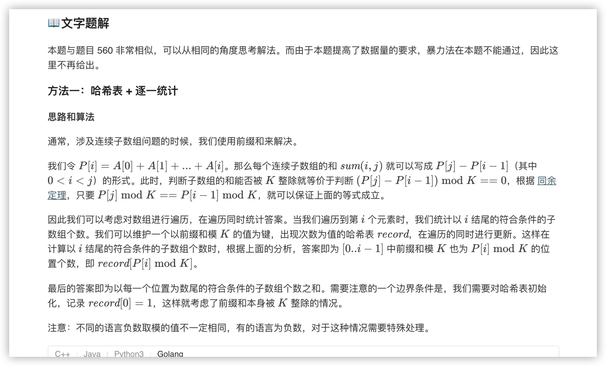
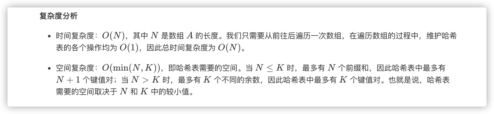
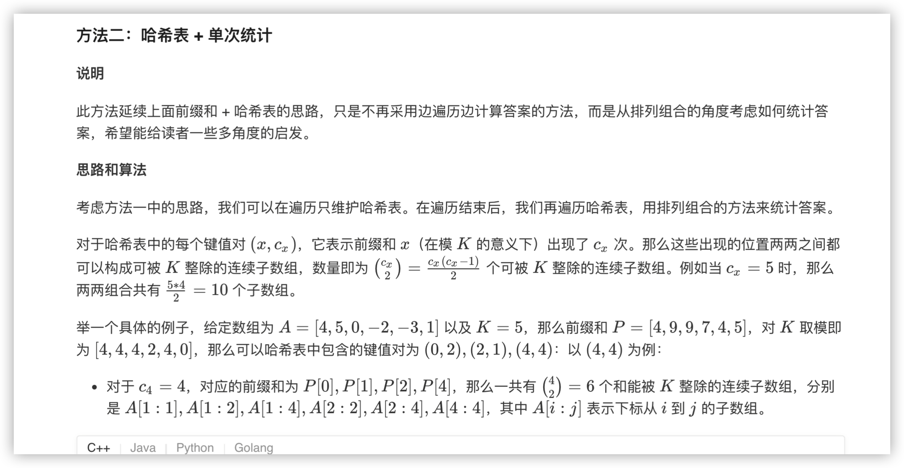
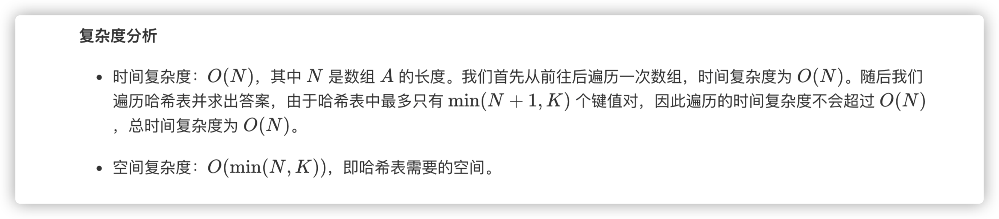

### 官方题解 [@link](https://leetcode-cn.com/problems/subarray-sums-divisible-by-k/solution/he-ke-bei-k-zheng-chu-de-zi-shu-zu-by-leetcode-sol/)


```Golang
func subarraysDivByK(A []int, K int) int {
    record := map[int]int{0: 1}
    sum, ans := 0, 0
    for _, elem := range A {
        sum += elem
        modulus := (sum % K + K) % K
        ans += record[modulus]
        record[modulus]++
    } 
    return ans
}
```


```Golang
func subarraysDivByK(A []int, K int) int {
    record := map[int]int{0: 1}
    sum, ans := 0, 0
    for _, elem := range A {
        sum += elem
        modulus := (sum % K + K) % K
        record[modulus]++
    }
    for _, cx := range record {
        ans += cx * (cx - 1) / 2
    }
    return ans
}
```
