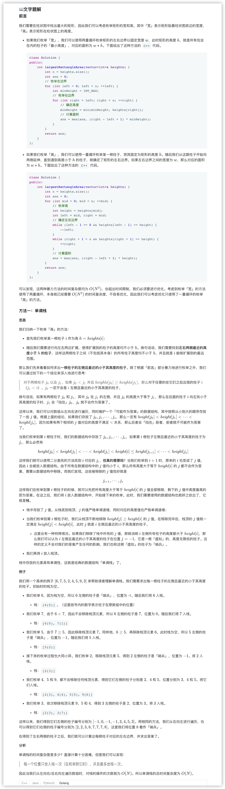
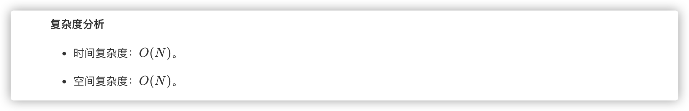
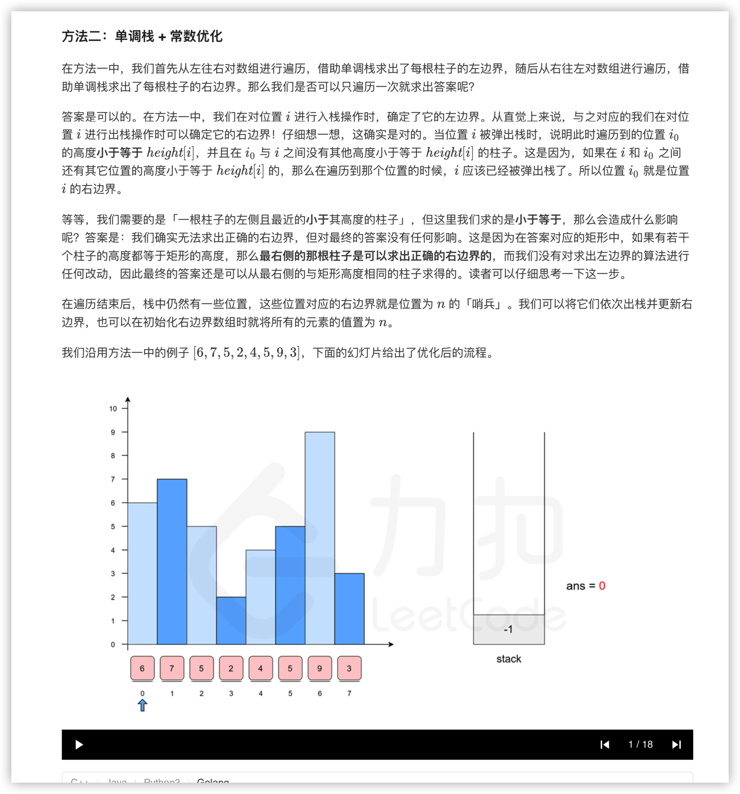
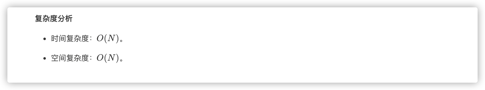

### 官方题解 [@link](https://leetcode-cn.com/problems/largest-rectangle-in-histogram/solution/zhu-zhuang-tu-zhong-zui-da-de-ju-xing-by-leetcode-/)


```Golang
func largestRectangleArea(heights []int) int {
    n := len(heights)
    left, right := make([]int, n), make([]int, n)
    mono_stack := []int{}
    for i := 0; i < n; i++ {
        for len(mono_stack) > 0 && heights[mono_stack[len(mono_stack)-1]] >= heights[i] {
            mono_stack = mono_stack[:len(mono_stack)-1]
        }
        if len(mono_stack) == 0 {
            left[i] = -1
        } else {
            left[i] = mono_stack[len(mono_stack)-1]
        }
        mono_stack = append(mono_stack, i)
    }
    mono_stack = []int{}
    for i := n - 1; i >= 0; i-- {
        for len(mono_stack) > 0 && heights[mono_stack[len(mono_stack)-1]] >= heights[i] {
            mono_stack = mono_stack[:len(mono_stack)-1]
        }
        if len(mono_stack) == 0 {
            right[i] = n
        } else {
            right[i] = mono_stack[len(mono_stack)-1]
        }
        mono_stack = append(mono_stack, i)
    }
    ans := 0
    for i := 0; i < n; i++ {
        ans = max(ans, (right[i] - left[i] - 1) * heights[i])
    }
    return ans
}

func max(x, y int) int {
    if x > y {
        return x
    }
    return y
}
```


```Golang
func largestRectangleArea(heights []int) int {
    n := len(heights)
    left, right := make([]int, n), make([]int, n)
    for i := 0; i < n; i++ {
        right[i] = n
    }
    mono_stack := []int{}
    for i := 0; i < n; i++ {
        for len(mono_stack) > 0 && heights[mono_stack[len(mono_stack)-1]] >= heights[i] {
            right[mono_stack[len(mono_stack)-1]] = i
            mono_stack = mono_stack[:len(mono_stack)-1]
        }
        if len(mono_stack) == 0 {
            left[i] = -1
        } else {
            left[i] = mono_stack[len(mono_stack)-1]
        }
        mono_stack = append(mono_stack, i)
    }
    ans := 0
    for i := 0; i < n; i++ {
        ans = max(ans, (right[i] - left[i] - 1) * heights[i])
    }
    return ans
}

func max(x, y int) int {
    if x > y {
        return x
    }
    return y
}
```
