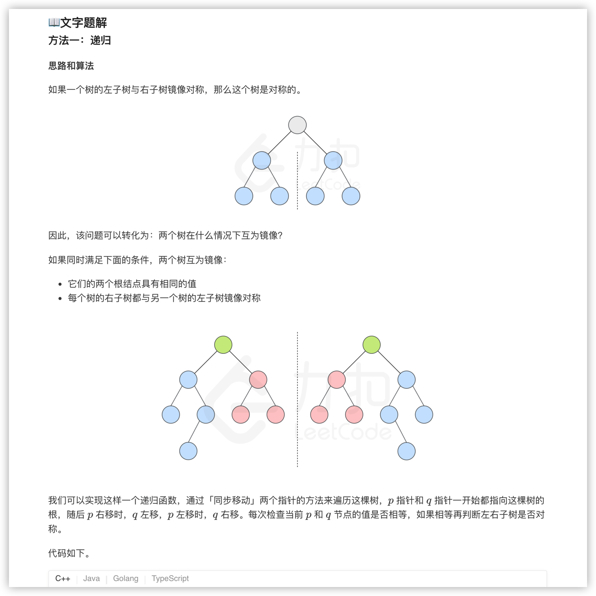
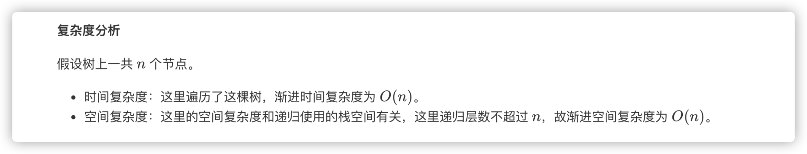
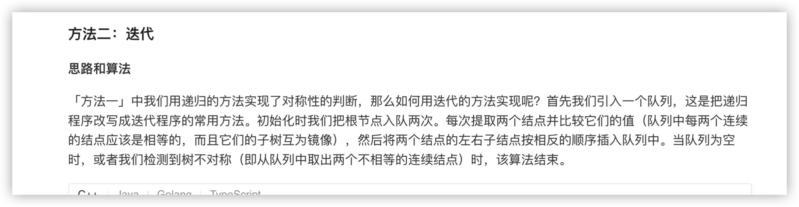
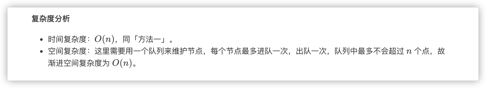

### 官方题解 [@link](https://leetcode-cn.com/problems/symmetric-tree/solution/dui-cheng-er-cha-shu-by-leetcode-solution/)


```Golang
func isSymmetric(root *TreeNode) bool {
    return check(root, root)
}

func check(p, q *TreeNode) bool {
    if p == nil && q == nil {
        return true
    }
    if p == nil || q == nil {
        return false
    }
    return p.Val == q.Val && check(p.Left, q.Right) && check(p.Right, q.Left) 
}
```


```Golang
func isSymmetric(root *TreeNode) bool {
    u, v := root, root
    q := []*TreeNode{}
    q = append(q, u)
    q = append(q, v)
    for len(q) > 0 {
        u, v = q[0], q[1]
        q = q[2:]
        if u == nil && v == nil {
            continue
        }
        if u == nil || v == nil {
            return false
        }
        if u.Val != v.Val {
            return false
        }
        q = append(q, u.Left)
        q = append(q, v.Right)

        q = append(q, u.Right)
        q = append(q, v.Left)
    }
    return true
}
```
