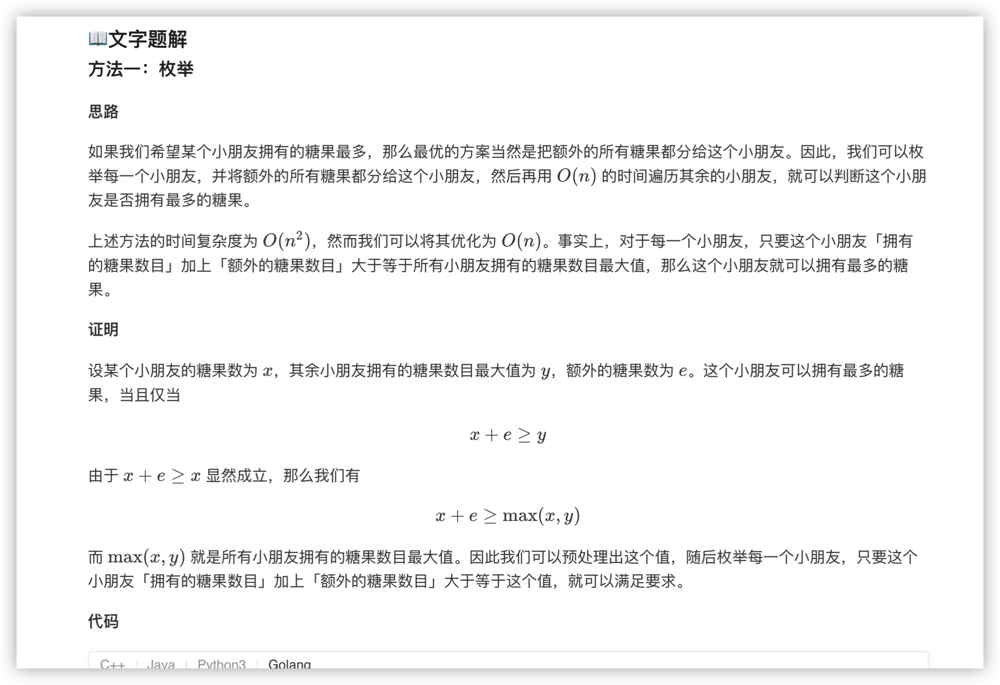
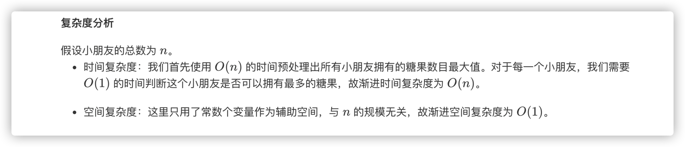

### 官方题解 [@link](https://leetcode-cn.com/problems/kids-with-the-greatest-number-of-candies/solution/yong-you-zui-duo-tang-guo-de-hai-zi-by-leetcode-so/)


```Golang
func kidsWithCandies(candies []int, extraCandies int) []bool {
    n := len(candies)
    maxCandies := 0
    for i := 0; i < n; i++ {
        maxCandies = max(maxCandies, candies[i])
    }
    ret := make([]bool, n)
    for i := 0; i < n; i++ {
        ret[i] = candies[i] + extraCandies >= maxCandies
    }
    return ret
}

func max(x, y int) int {
    if x > y {
        return x
    }
    return y
}
```
