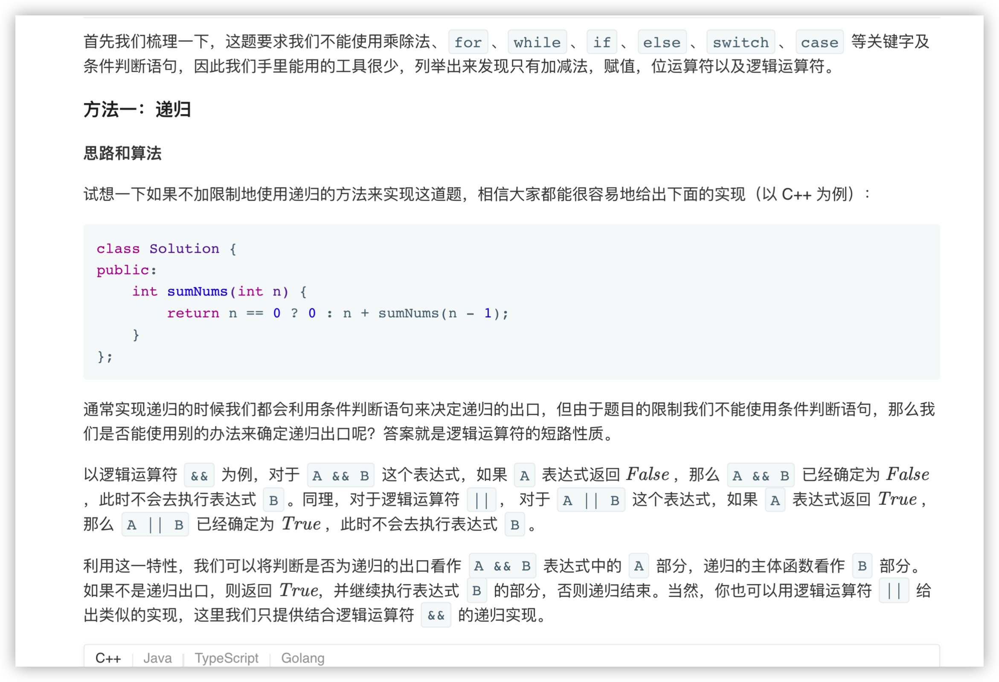
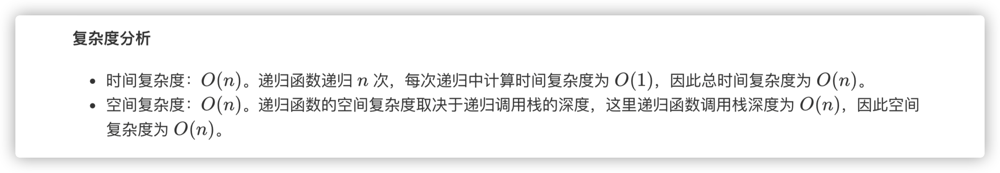
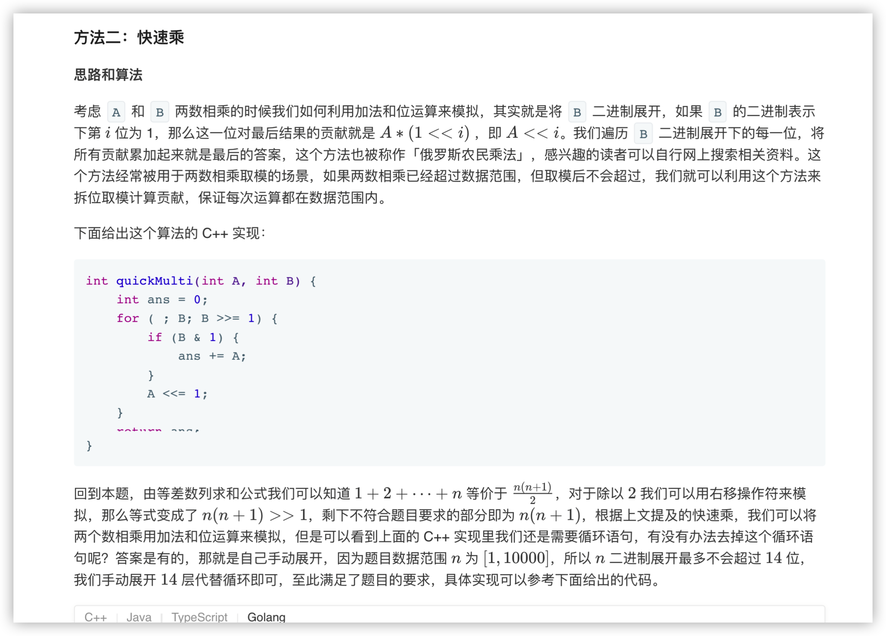
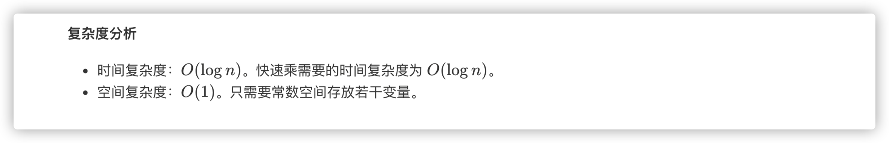

### 官方题解 [@link](https://leetcode-cn.com/problems/qiu-12n-lcof/solution/qiu-12n-by-leetcode-solution/)


```Golang
func sumNums(n int) int {
    ans := 0
    var sum func(int) bool
    sum = func(n int) bool {
        ans += n
        return n > 0 && sum(n-1)
    }
    sum(n)
    return ans
}
```


```Golang
func sumNums(n int) int {
    ans, A, B := 0, n, n + 1
    addGreatZero := func() bool {
        ans += A
        return ans > 0
    }

    _ = ((B & 1) > 0) && addGreatZero()
    A <<= 1
    B >>= 1

    _ = ((B & 1) > 0) && addGreatZero()
    A <<= 1
    B >>= 1

    _ = ((B & 1) > 0) && addGreatZero()
    A <<= 1
    B >>= 1

    _ = ((B & 1) > 0) && addGreatZero()
    A <<= 1
    B >>= 1

    _ = ((B & 1) > 0) && addGreatZero()
    A <<= 1
    B >>= 1

    _ = ((B & 1) > 0) && addGreatZero()
    A <<= 1
    B >>= 1

    _ = ((B & 1) > 0) && addGreatZero()
    A <<= 1
    B >>= 1

    _ = ((B & 1) > 0) && addGreatZero()
    A <<= 1
    B >>= 1

    _ = ((B & 1) > 0) && addGreatZero()
    A <<= 1
    B >>= 1

    _ = ((B & 1) > 0) && addGreatZero()
    A <<= 1
    B >>= 1

    _ = ((B & 1) > 0) && addGreatZero()
    A <<= 1
    B >>= 1

    _ = ((B & 1) > 0) && addGreatZero()
    A <<= 1
    B >>= 1

    _ = ((B & 1) > 0) && addGreatZero()
    A <<= 1
    B >>= 1

    _ = ((B & 1) > 0) && addGreatZero()
    A <<= 1
    B >>= 1
    return ans >> 1
}
```
