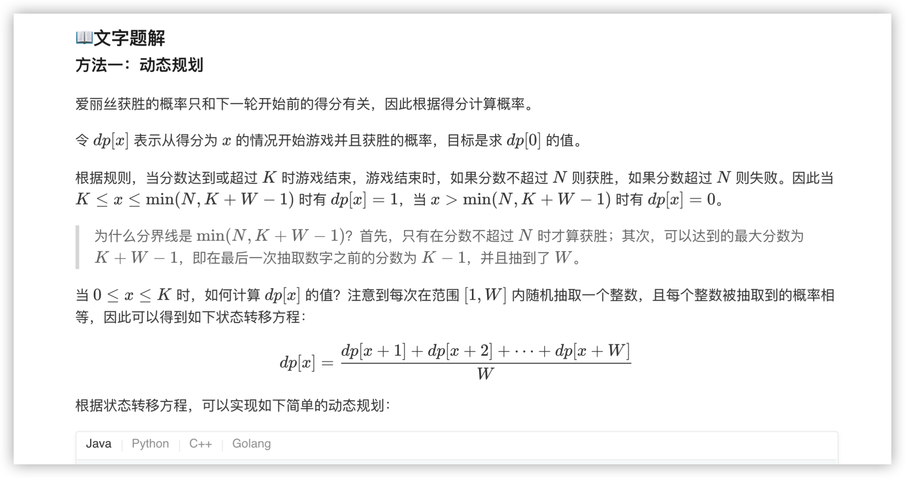
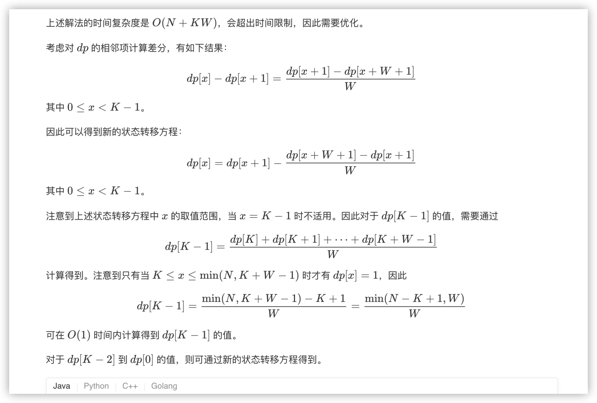

### 官方题解 [@link](https://leetcode-cn.com/problems/new-21-game/solution/xin-21dian-by-leetcode-solution/)


```Golang
func new21Game(N int, K int, W int) float64 {
    if K == 0 {
        return 1.0
    }
    dp := make([]float64, K + W + 1)
    for i := K; i <= N && i < K + W; i++ {
        dp[i] = 1.0
    }
    for i := K - 1; i >= 0; i-- {
        for j := 1; j <= W; j++ {
            dp[i] += dp[i + j] / float64(W)
        }
    }
    return dp[0]
}
```

```Golang
func new21Game(N int, K int, W int) float64 {
    if K == 0 {
        return 1.0
    }
    dp := make([]float64, K + W + 1)
    for i := K; i <= N && i < K + W; i++ {
        dp[i] = 1.0
    }

    dp[K - 1] = 1.0 * float64(min(N - K + 1, W)) / float64(W)
    for i := K - 2; i >= 0; i-- {
        dp[i] = dp[i + 1] - (dp[i + W + 1] - dp[i + 1]) / float64(W) 
    }
    return dp[0]
}

func min(x, y int) int {
    if x < y {
        return x
    }
    return y
}
```
