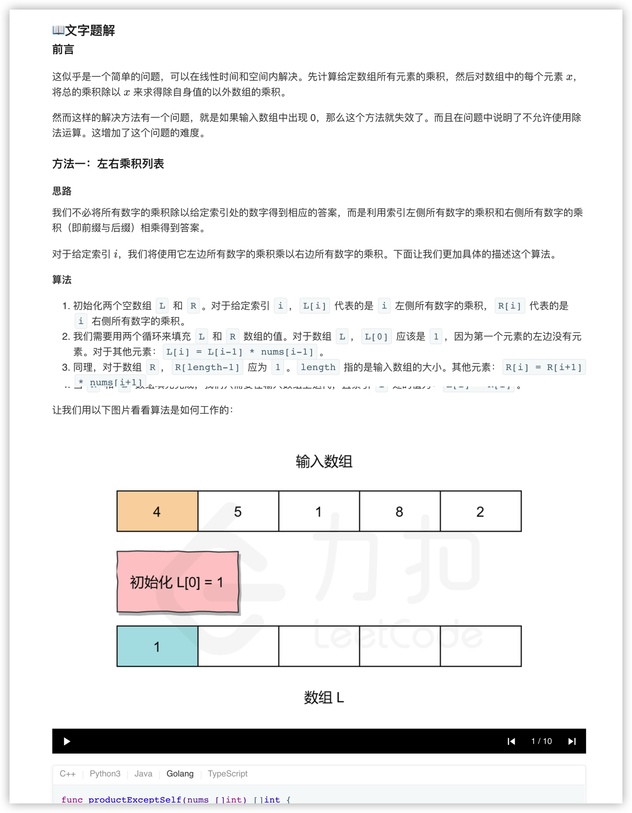
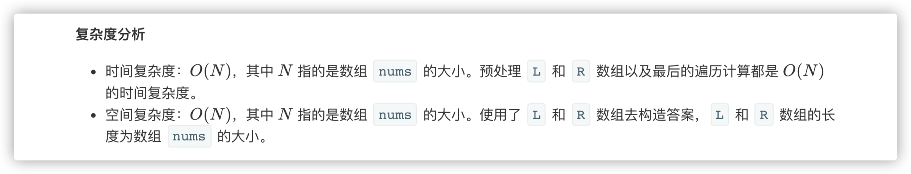
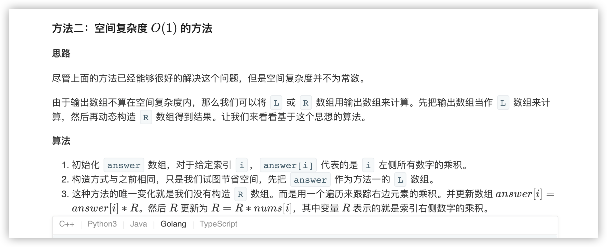
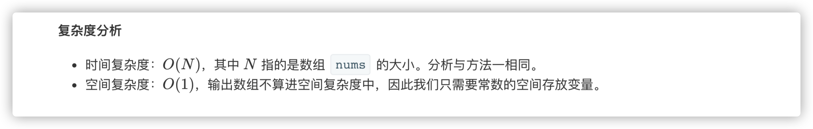

### 官方题解 [@link](https://leetcode-cn.com/problems/product-of-array-except-self/solution/chu-zi-shen-yi-wai-shu-zu-de-cheng-ji-by-leetcode-/)


```Golang
func productExceptSelf(nums []int) []int {
    length := len(nums)

    // L 和 R 分别表示左右两侧的乘积列表
    L, R, answer := make([]int, length), make([]int, length), make([]int, length)

    // L[i] 为索引 i 左侧所有元素的乘积
    // 对于索引为 '0' 的元素，因为左侧没有元素，所以 L[0] = 1
    L[0] = 1
    for i := 1; i < length; i++ {
        L[i] = nums[i-1] * L[i-1]
    }

    // R[i] 为索引 i 右侧所有元素的乘积
    // 对于索引为 'length-1' 的元素，因为右侧没有元素，所以 R[length-1] = 1
    R[length-1] = 1
    for i := length - 2; i >= 0; i-- {
        R[i] = nums[i+1] * R[i+1]
    }
    
    // 对于索引 i，除 nums[i] 之外其余各元素的乘积就是左侧所有元素的乘积乘以右侧所有元素的乘积
    for i := 0; i < length; i++ {
        answer[i] = L[i] * R[i]
    }
    return answer
}
```


```Golang
func productExceptSelf(nums []int) []int {
    length := len(nums)
    answer := make([]int, length)

    // answer[i] 表示索引 i 左侧所有元素的乘积
    // 因为索引为 '0' 的元素左侧没有元素， 所以 answer[0] = 1
    answer[0] = 1
    for i := 1; i < length; i++ {
        answer[i] = nums[i-1] * answer[i-1]
    }

    // R 为右侧所有元素的乘积
    // 刚开始右边没有元素，所以 R = 1
    R := 1
    for i := length - 1; i >= 0; i-- {
        // 对于索引 i，左边的乘积为 answer[i]，右边的乘积为 R
        answer[i] = answer[i] * R
        // R 需要包含右边所有的乘积，所以计算下一个结果时需要将当前值乘到 R 上
        R *= nums[i]
    }
    return answer
}
```
