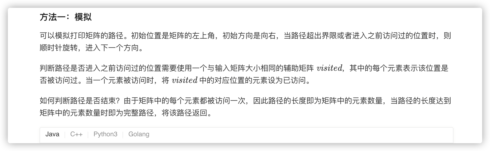
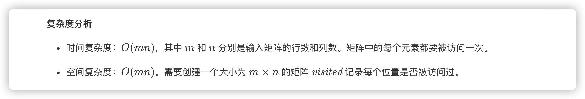
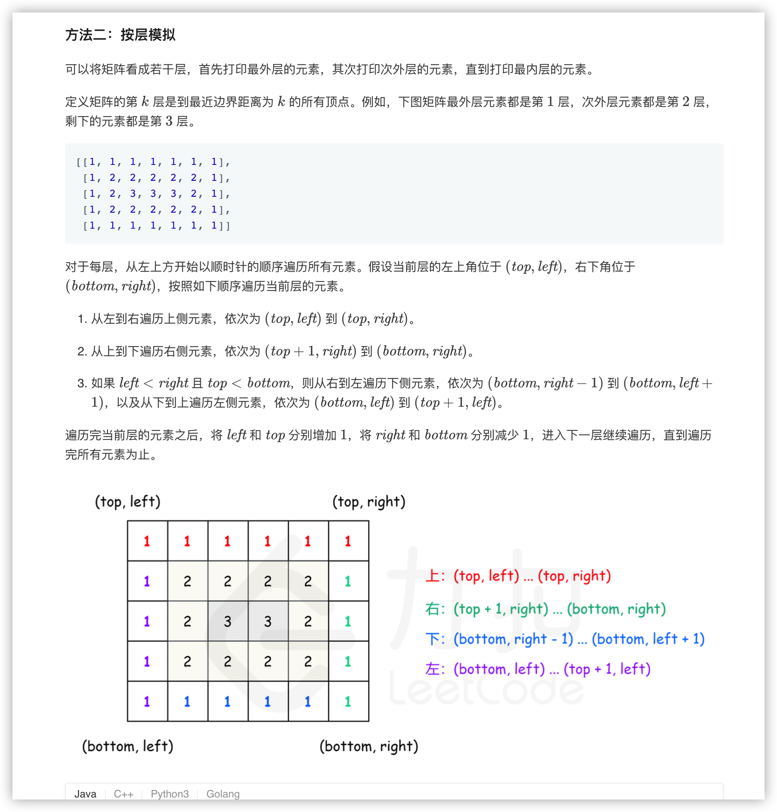
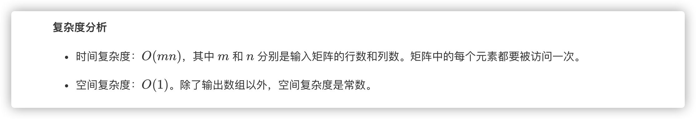

### 官方题解 [@link](https://leetcode-cn.com/problems/shun-shi-zhen-da-yin-ju-zhen-lcof/solution/shun-shi-zhen-da-yin-ju-zhen-by-leetcode-solution/)


```Golang
func spiralOrder(matrix [][]int) []int {
    if len(matrix) == 0 || len(matrix[0]) == 0 {
        return []int{}
    }
    rows, columns := len(matrix), len(matrix[0])
    visited := make([][]bool, rows)
    for i := 0; i < rows; i++ {
        visited[i] = make([]bool, columns)
    }

    var (
        total = rows * columns
        order = make([]int, total)
        row, column = 0, 0
        directions = [][]int{[]int{0, 1}, []int{1, 0}, []int{0, -1}, []int{-1, 0}}
        directionIndex = 0
    )

    for i := 0; i < total; i++ {
        order[i] = matrix[row][column]
        visited[row][column] = true
        nextRow, nextColumn := row + directions[directionIndex][0], column + directions[directionIndex][1]
        if nextRow < 0 || nextRow >= rows || nextColumn < 0 || nextColumn >= columns || visited[nextRow][nextColumn] {
            directionIndex = (directionIndex + 1) % 4
        }
        row += directions[directionIndex][0]
        column += directions[directionIndex][1]
    }
    return order
}
```


```Golang
func spiralOrder(matrix [][]int) []int {
    if len(matrix) == 0 || len(matrix[0]) == 0 {
        return []int{}
    }
    var (
        rows, columns = len(matrix), len(matrix[0])
        order = make([]int, rows * columns)
        index = 0
        left, right, top, bottom = 0, columns - 1, 0, rows - 1
    )

    for left <= right && top <= bottom {
        for column := left; column <= right; column++ {
            order[index] = matrix[top][column]
            index++
        }
        for row := top + 1; row <= bottom; row++ {
            order[index] = matrix[row][right]
            index++
        }
        if left < right && top < bottom {
            for column := right - 1; column > left; column-- {
                order[index] = matrix[bottom][column]
                index++
            }
            for row := bottom; row > top; row-- {
                order[index] = matrix[row][left]
                index++
            }
        }
        left++
        right--
        top++
        bottom--
    }
    return order
}
```
