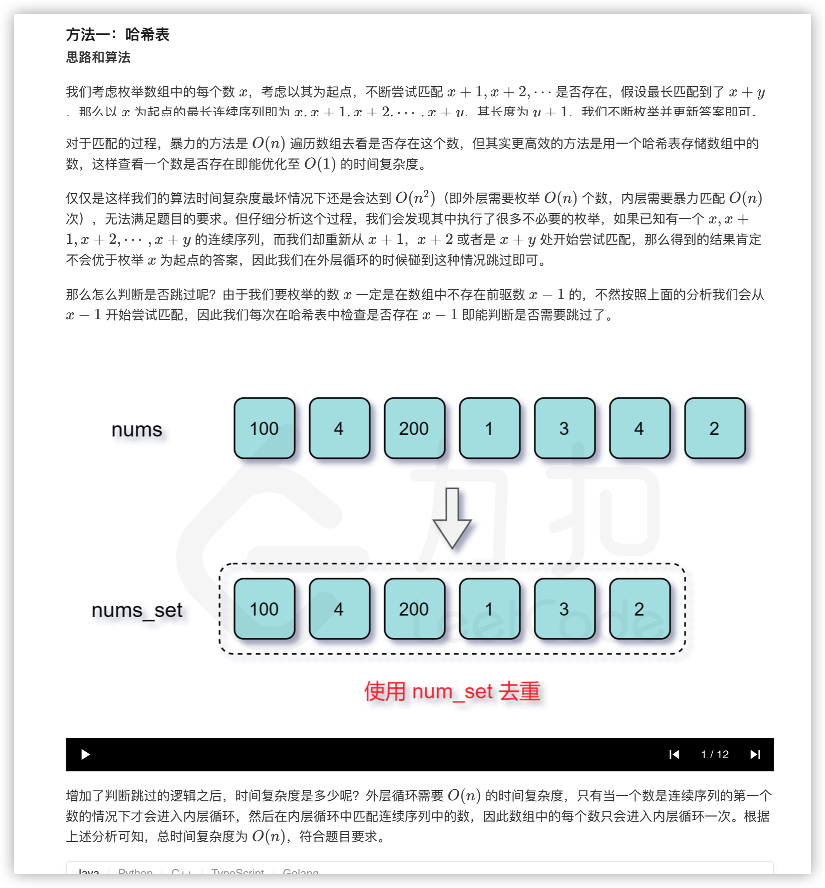

### 官方题解 [@link](https://leetcode-cn.com/problems/longest-consecutive-sequence/solution/zui-chang-lian-xu-xu-lie-by-leetcode-solution/)


```Golang
func longestConsecutive(nums []int) int {
    numSet := map[int]bool{}
    for _, num := range nums {
        numSet[num] = true
    }
    longestStreak := 0
    for num := range numSet {
        if !numSet[num-1] {
            currentNum := num
            currentStreak := 1
            for numSet[currentNum+1] {
                currentNum++
                currentStreak++
            }
            if longestStreak < currentStreak {
                longestStreak = currentStreak
            }
        }
    }
    return longestStreak
}
```
