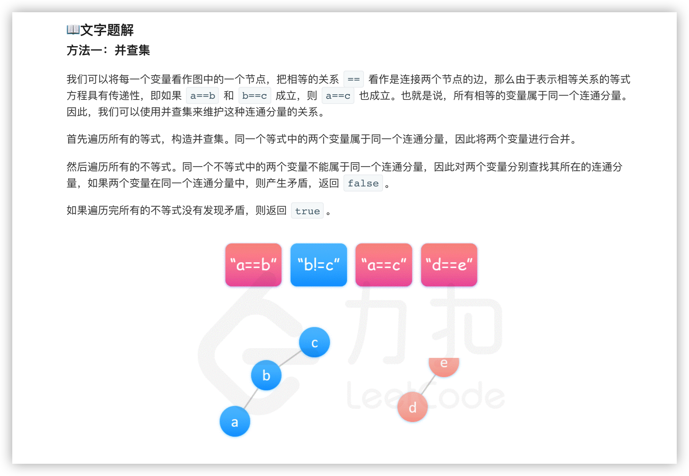
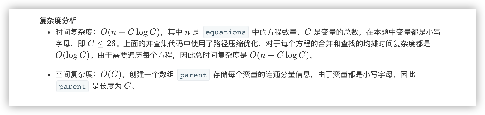

### 官方题解 [@link](https://leetcode-cn.com/problems/satisfiability-of-equality-equations/solution/deng-shi-fang-cheng-de-ke-man-zu-xing-by-leetcode-/)


```Golang
func equationsPossible(equations []string) bool {
    parent := make([]int, 26)
    for i := 0; i < 26; i++ {
        parent[i] = i
    }
    for _, str := range equations {
        if str[1] == '=' {
            index1 := int(str[0] - 'a')
            index2 := int(str[3] - 'a')
            union(parent, index1, index2)
        }
    }

    for _, str := range equations {
        if str[1] == '!' {
            index1 := int(str[0] - 'a')
            index2 := int(str[3] - 'a')
            if find(parent, index1) == find(parent, index2) {
                return false
            }
        }
    }
    return true
}

func union(parent []int, index1, index2 int) {
    parent[find(parent, index1)] = find(parent, index2)
}

func find(parent []int, index int) int {
    for parent[index] != index {
        parent[index] = parent[parent[index]]
        index = parent[index]
    }
    return index
}
```
