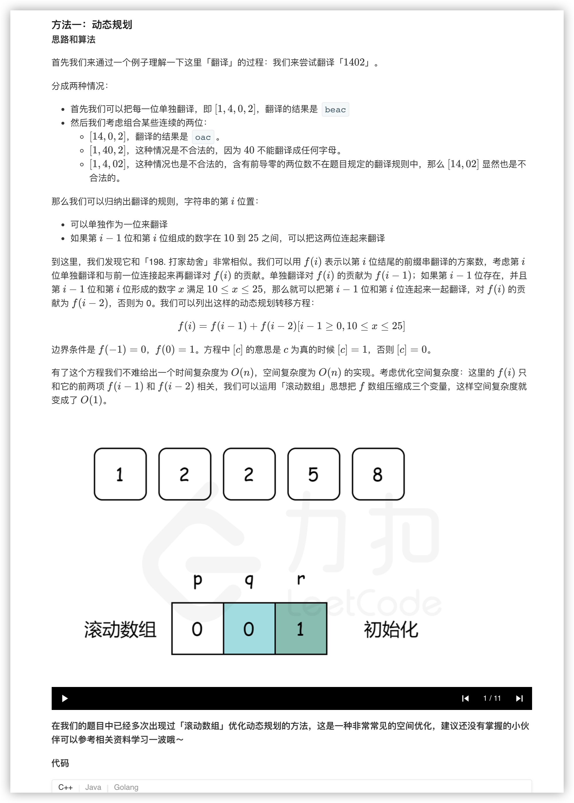
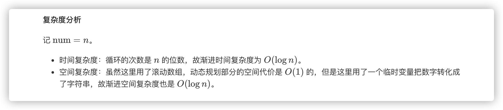

### 官方题解 [@link](https://leetcode-cn.com/problems/ba-shu-zi-fan-yi-cheng-zi-fu-chuan-lcof/solution/ba-shu-zi-fan-yi-cheng-zi-fu-chuan-by-leetcode-sol/)


```Golang
func translateNum(num int) int {
    src := strconv.Itoa(num)
    p, q, r := 0, 0, 1
    for i := 0; i < len(src); i++ {
        p, q, r = q, r, 0
        r += q
        if i == 0 {
            continue
        }
        pre := src[i-1:i+1]
        if pre <= "25" && pre >= "10" {
            r += p
        }
    }
    return r
}
```
