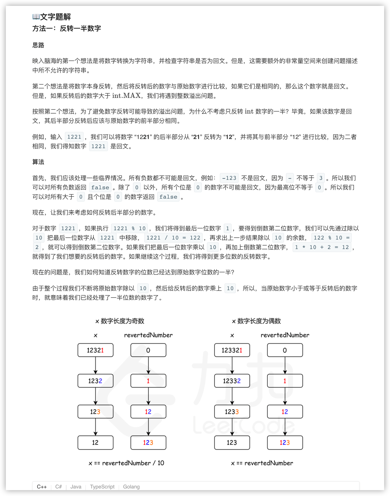

### 官方题解 [@link](https://leetcode-cn.com/problems/palindrome-number/solution/hui-wen-shu-by-leetcode-solution/)


```Golang
func isPalindrome(x int) bool {
    // 特殊情况：
    // 如上所述，当 x < 0 时，x 不是回文数。
    // 同样地，如果数字的最后一位是 0，为了使该数字为回文，
    // 则其第一位数字也应该是 0
    // 只有 0 满足这一属性
    if x < 0 || (x % 10 == 0 && x != 0) {
        return false
    }

    revertedNumber := 0
    for x > revertedNumber {
        revertedNumber = revertedNumber * 10 + x % 10
        x /= 10
    }

    // 当数字长度为奇数时，我们可以通过 revertedNumber/10 去除处于中位的数字。
    // 例如，当输入为 12321 时，在 while 循环的末尾我们可以得到 x = 12，revertedNumber = 123，
    // 由于处于中位的数字不影响回文（它总是与自己相等），所以我们可以简单地将其去除。
    return x == revertedNumber || x == revertedNumber / 10
}
```
