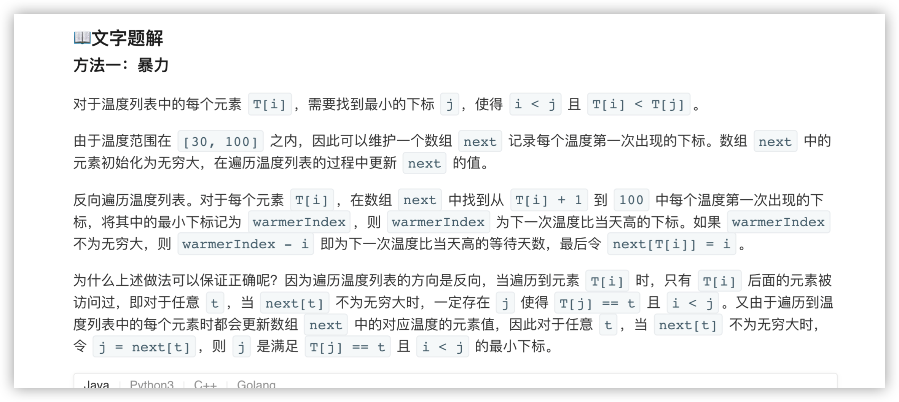
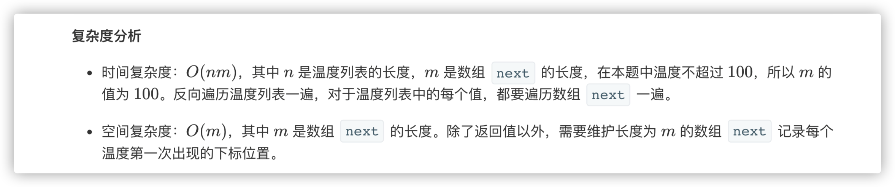
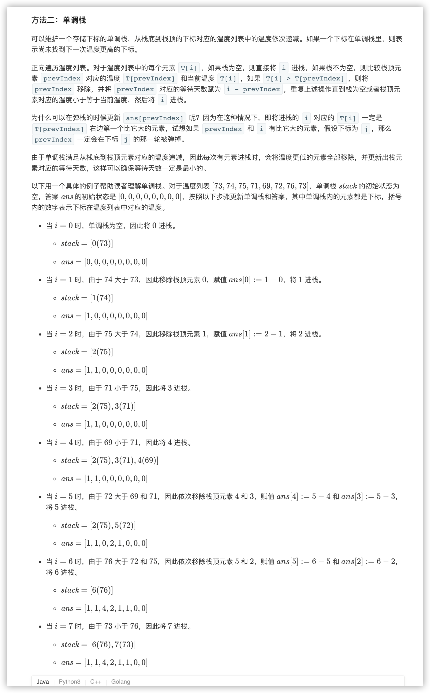
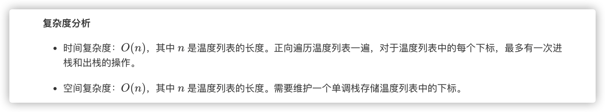

### 官方题解 [@link](https://leetcode-cn.com/problems/daily-temperatures/solution/mei-ri-wen-du-by-leetcode-solution/)


```Golang
func dailyTemperatures(T []int) []int {
    length := len(T)
    ans := make([]int, length)
    next := make([]int, 101)
    for i := 0; i < 101; i++ {
        next[i] = math.MaxInt32
    }
    for i := length - 1; i >= 0; i-- {
        warmerIndex := math.MaxInt32
        for t := T[i] + 1; t <= 100; t++ {
            if next[t] < warmerIndex {
                warmerIndex = next[t]
            }
        }
        if warmerIndex < math.MaxInt32 {
            ans[i] = warmerIndex - i
        }
        next[T[i]] = i
    }
    return ans
}
```


```Golang
func dailyTemperatures(T []int) []int {
    length := len(T)
    ans := make([]int, length)
    stack := []int{}
    for i := 0; i < length; i++ {
        temperature := T[i]
        for len(stack) > 0 && temperature > T[stack[len(stack)-1]] {
            prevIndex := stack[len(stack)-1]
            stack = stack[:len(stack)-1]
            ans[prevIndex] = i - prevIndex
        }
        stack = append(stack, i)
    }
    return ans
}
```
