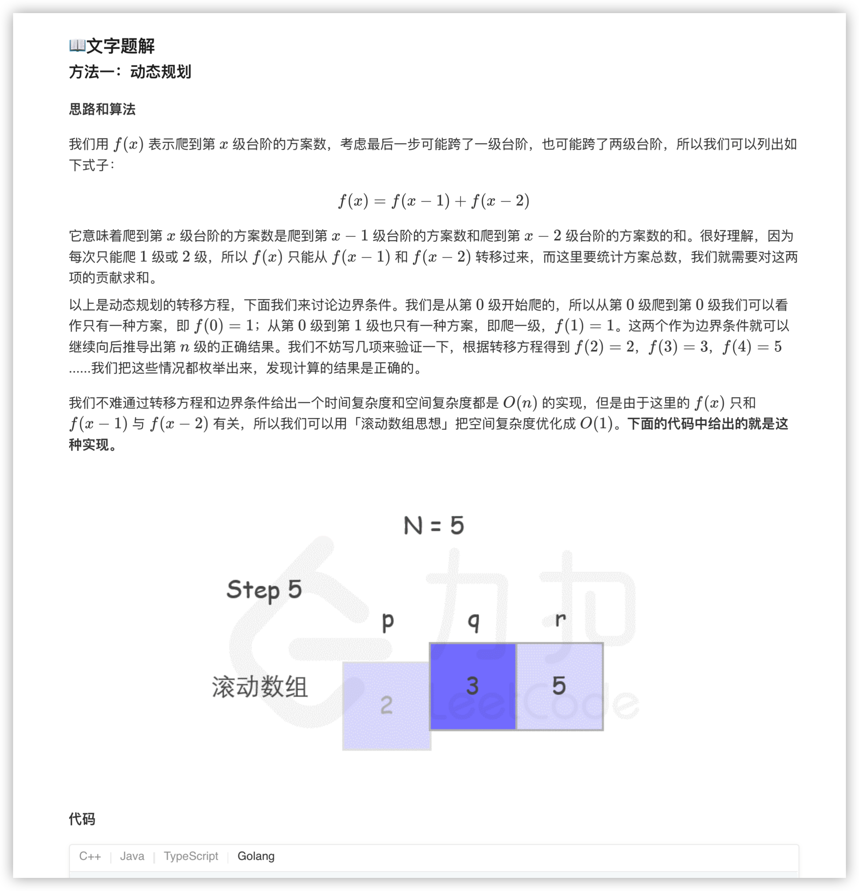
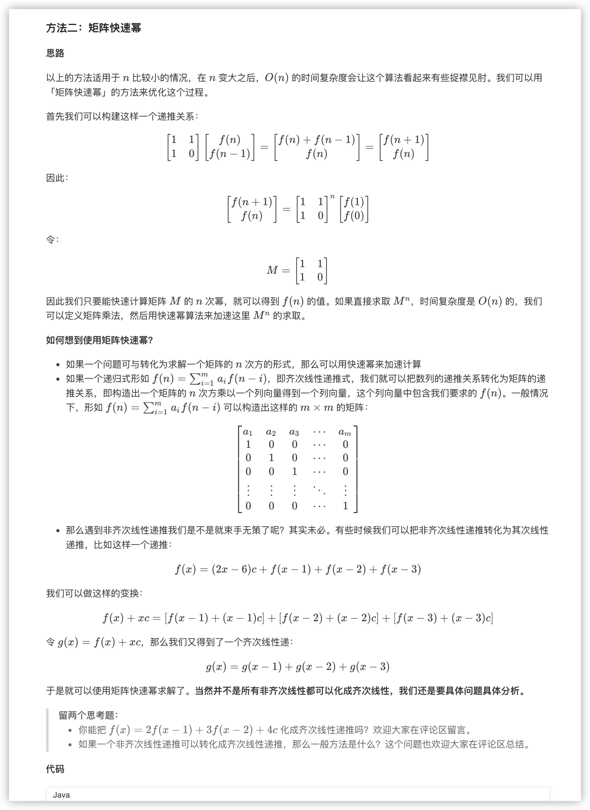
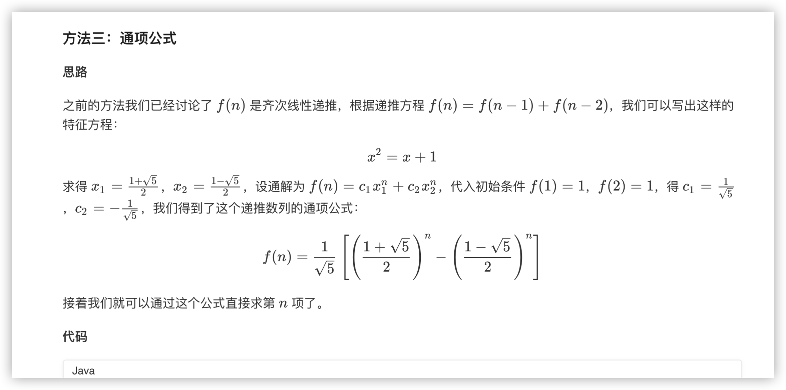
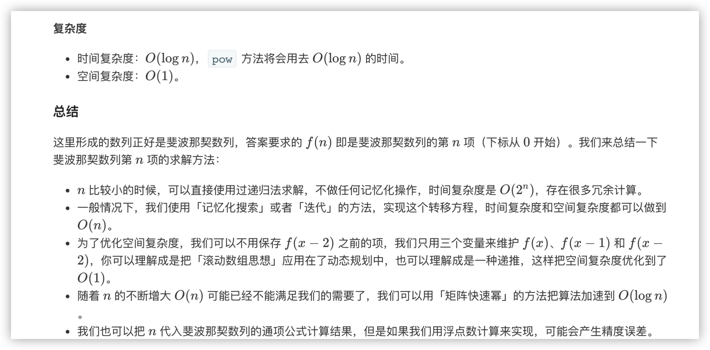

### 官方题解 [@link](https://leetcode-cn.com/problems/climbing-stairs/solution/pa-lou-ti-by-leetcode-solution/)


```Golang
func climbStairs(n int) int {
    p, q, r := 0, 0, 1
    for i := 1; i <= n; i++ {
        p = q
        q = r
        r = p + q
    }
    return r
}
```


```java
public class Solution {
   public int climbStairs(int n) {
       int[][] q = {{1, 1}, {1, 0}};
       int[][] res = pow(q, n);
       return res[0][0];
   }
   public int[][] pow(int[][] a, int n) {
       int[][] ret = {{1, 0}, {0, 1}};
       while (n > 0) {
           if ((n & 1) == 1) {
               ret = multiply(ret, a);
           }
           n >>= 1;
           a = multiply(a, a);
       }
       return ret;
   }
   public int[][] multiply(int[][] a, int[][] b) {
       int[][] c = new int[2][2];
       for (int i = 0; i < 2; i++) {
           for (int j = 0; j < 2; j++) {
               c[i][j] = a[i][0] * b[0][j] + a[i][1] * b[1][j];
           }
       }
       return c;
   }
}
```


```java
public class Solution {
    public int climbStairs(int n) {
        double sqrt5 = Math.sqrt(5);
        double fibn = Math.pow((1 + sqrt5) / 2, n + 1) - Math.pow((1 - sqrt5) / 2, n + 1);
        return (int)(fibn / sqrt5);
    }
}
```
