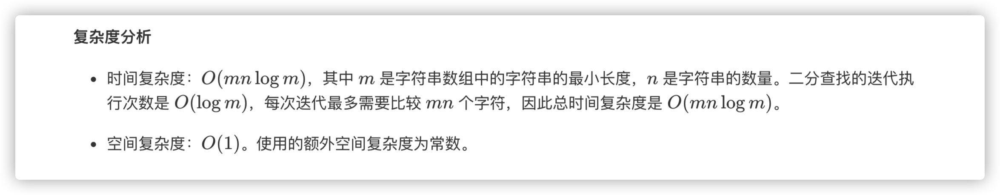

### 官方题解 [@link](https://leetcode-cn.com/problems/longest-common-prefix/solution/zui-chang-gong-gong-qian-zhui-by-leetcode-solution/)


```Golang
func longestCommonPrefix(strs []string) string {
    if len(strs) == 0 {
        return ""
    }
    prefix := strs[0]
    count := len(strs)
    for i := 1; i < count; i++ {
        prefix = lcp(prefix, strs[i])
        if len(prefix) == 0 {
            break
        }
    }
    return prefix
}

func lcp(str1, str2 string) string {
    length := min(len(str1), len(str2))
    index := 0
    for index < length && str1[index] == str2[index] {
        index++
    }
    return str1[:index]
}

func min(x, y int) int {
    if x < y {
        return x
    }
    return y
}
```


```Golang
func longestCommonPrefix(strs []string) string {
    if len(strs) == 0 {
        return ""
    }
    for i := 0; i < len(strs[0]); i++ {
        for j := 1; j < len(strs); j++ {
            if i == len(strs[j]) || strs[j][i] != strs[0][i] {
                return strs[0][:i]
            }
        }
    }
    return strs[0]
}
```


```Golang
func longestCommonPrefix(strs []string) string {
    if len(strs) == 0 {
        return ""
    }
    var lcp func(int, int) string
    lcp = func(start, end int) string {
        if start == end {
            return strs[start]
        }
        mid := (start + end) / 2
        lcpLeft, lcpRight := lcp(start, mid), lcp(mid + 1, end)
        minLength := min(len(lcpLeft), len(lcpRight))
        for i := 0; i < minLength; i++ {
            if lcpLeft[i] != lcpRight[i] {
                return lcpLeft[:i]
            }
        }
        return lcpLeft[:minLength]
    }
    return lcp(0, len(strs)-1)
}

func min(x, y int) int {
    if x < y {
        return x
    }
    return y
}
```


```Golang
func longestCommonPrefix(strs []string) string {
    if len(strs) == 0 {
        return ""
    }

    isCommonPrefix := func(length int) bool {
        str0, count := strs[0][:length], len(strs)
        for i := 1; i < count; i++ {
            if strs[i][:length] != str0 {
                return false
            }
        }
        return true
    }
    minLength := len(strs[0])
    for _, s := range strs {
        if len(s) < minLength {
            minLength = len(s)
        }
    }
    low, high := 0, minLength
    for low < high {
        mid := (high - low + 1) / 2 + low
        if isCommonPrefix(mid) {
            low = mid
        } else {
            high = mid - 1
        }
    }
    return strs[0][:low]
}
```
