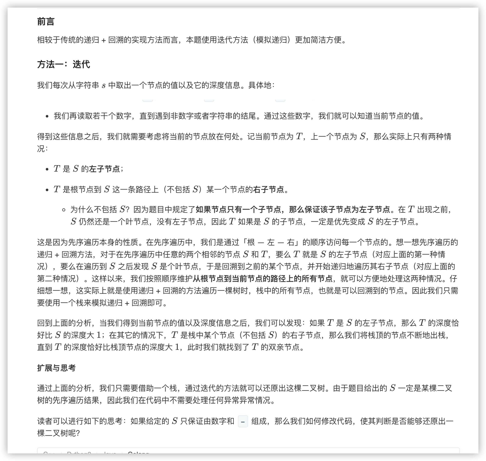
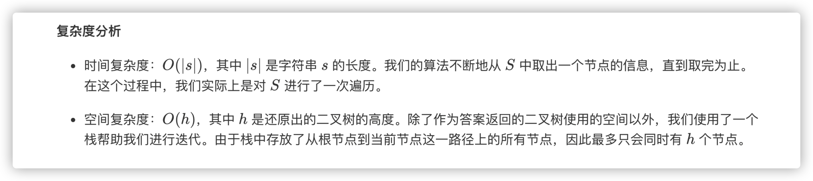

### 官方题解 [@link](https://leetcode-cn.com/problems/recover-a-tree-from-preorder-traversal/solution/cong-xian-xu-bian-li-huan-yuan-er-cha-shu-by-leetc/)


```Golang
func recoverFromPreorder(S string) *TreeNode {
    path, pos := []*TreeNode{}, 0
    for pos < len(S) {
        level := 0
        for S[pos] == '-' {
            level++
            pos++
        }
        value := 0
        for ; pos < len(S) && S[pos] >= '0' && S[pos] <= '9'; pos++ {
            value = value * 10 + int(S[pos] - '0')
        }
        node := &TreeNode{Val: value}
        if level == len(path) {
            if len(path) > 0 { path[len(path)-1].Left = node }
        } else {
            path = path[:level]
            path[len(path)-1].Right = node
        }
        path = append(path, node)
    }
    return path[0]
}
```
