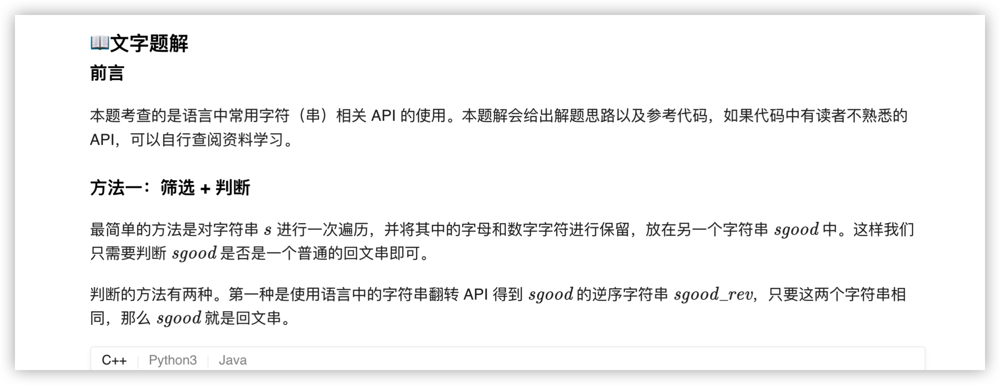
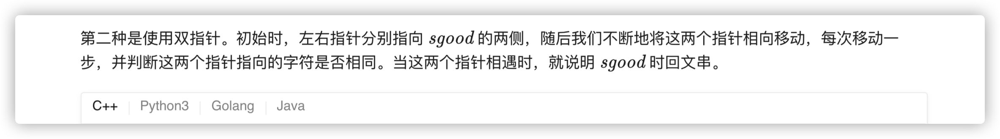
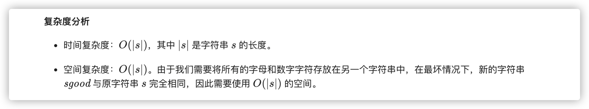
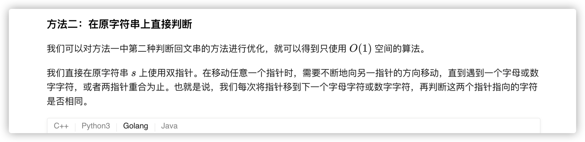
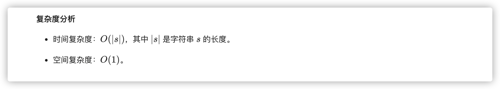

### 官方题解 [@link](https://leetcode-cn.com/problems/valid-palindrome/solution/yan-zheng-hui-wen-chuan-by-leetcode-solution/)


```C++
class Solution {
public:
    bool isPalindrome(string s) {
        string sgood;
        for (char ch: s) {
            if (isalnum(ch)) {
                sgood += tolower(ch);
            }
        }
        string sgood_rev(sgood.rbegin(), sgood.rend());
        return sgood == sgood_rev;
    }
};
```

```Golang
func isPalindrome(s string) bool {
    var sgood string
    for i := 0; i < len(s); i++ {
        if isalnum(s[i]) {
            sgood += string(s[i])
        }
    }

    n := len(sgood)
    sgood = strings.ToLower(sgood)
    for i := 0; i < n/2; i++ {
        if sgood[i] != sgood[n-1-i] {
            return false
        }
    }
    return true
}

func isalnum(ch byte) bool {
    return (ch >= 'A' && ch <= 'Z') || (ch >= 'a' && ch <= 'z') || (ch >= '0' && ch <= '9')
}
```


```Golang
func isPalindrome(s string) bool {
    s = strings.ToLower(s)
    left, right := 0, len(s) - 1
    for left < right {
        for left < right && !isalnum(s[left]) {
            left++
        }
        for left < right && !isalnum(s[right]) {
            right--
        }
        if left < right {
            if s[left] != s[right] {
                return false
            }
            left++
            right--
        }
    }
    return true
}

func isalnum(ch byte) bool {
    return (ch >= 'A' && ch <= 'Z') || (ch >= 'a' && ch <= 'z') || (ch >= '0' && ch <= '9')
}
```
