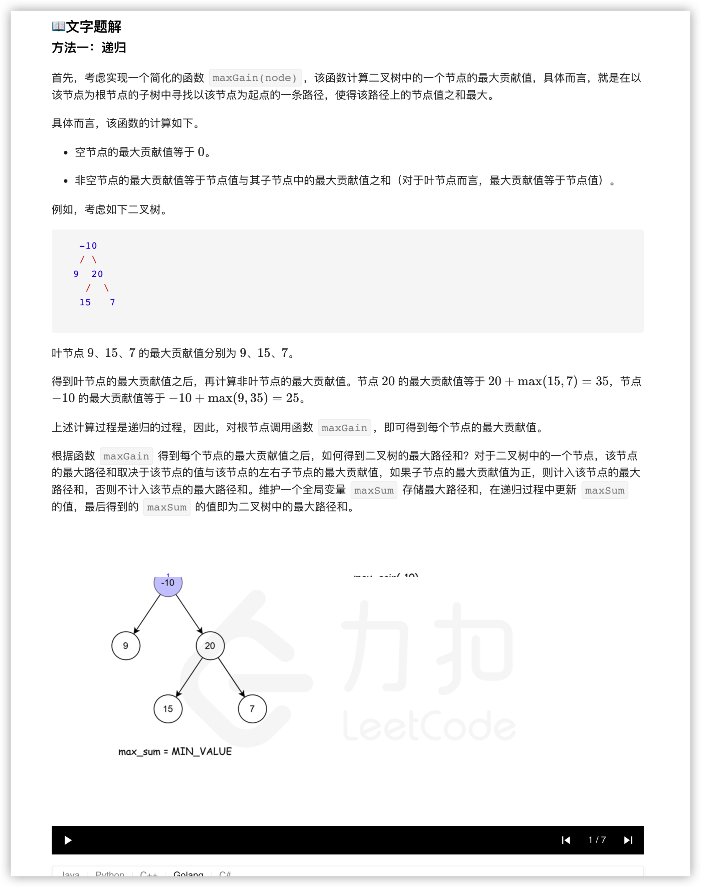

### 官方题解 [@link](https://leetcode-cn.com/problems/binary-tree-maximum-path-sum/solution/er-cha-shu-zhong-de-zui-da-lu-jing-he-by-leetcode-/)


```Golang
func maxPathSum(root *TreeNode) int {
    maxSum := math.MinInt32
    var maxGain func(*TreeNode) int
    maxGain = func(node *TreeNode) int {
        if node == nil {
            return 0
        }

        // 递归计算左右子节点的最大贡献值
        // 只有在最大贡献值大于 0 时，才会选取对应子节点
        leftGain := max(maxGain(node.Left), 0)
        rightGain := max(maxGain(node.Right), 0)

        // 节点的最大路径和取决于该节点的值与该节点的左右子节点的最大贡献值
        priceNewPath := node.Val + leftGain + rightGain

        // 更新答案
        maxSum = max(maxSum, priceNewPath)

        // 返回节点的最大贡献值
        return node.Val + max(leftGain, rightGain)
    }
    maxGain(root)
    return maxSum
}

func max(x, y int) int {
    if x > y {
        return x
    }
    return y
}
```
