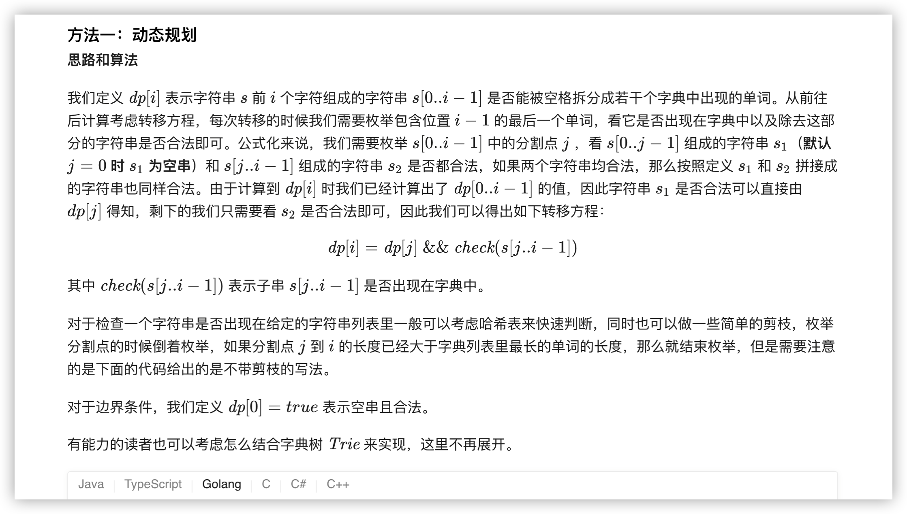
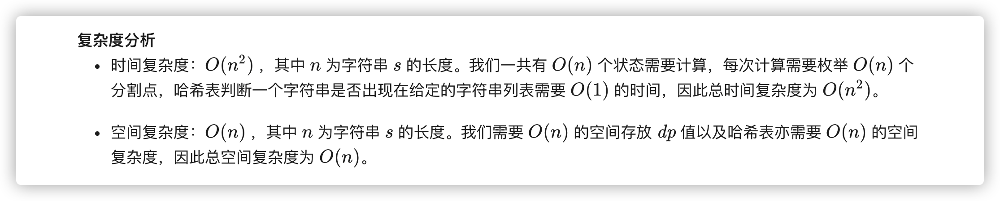

### 官方题解 [@link](https://leetcode-cn.com/problems/word-break/solution/dan-ci-chai-fen-by-leetcode-solution/)


```Golang
func wordBreak(s string, wordDict []string) bool {
    wordDictSet := make(map[string]bool)
    for _, w := range wordDict {
        wordDictSet[w] = true
    }
    dp := make([]bool, len(s) + 1)
    dp[0] = true
    for i := 1; i <= len(s); i++ {
        for j := 0; j < i; j++ {
            if dp[j] && wordDictSet[s[j:i]] {
                dp[i] = true
                break
            }
        }
    }
    return dp[len(s)]
}
```
