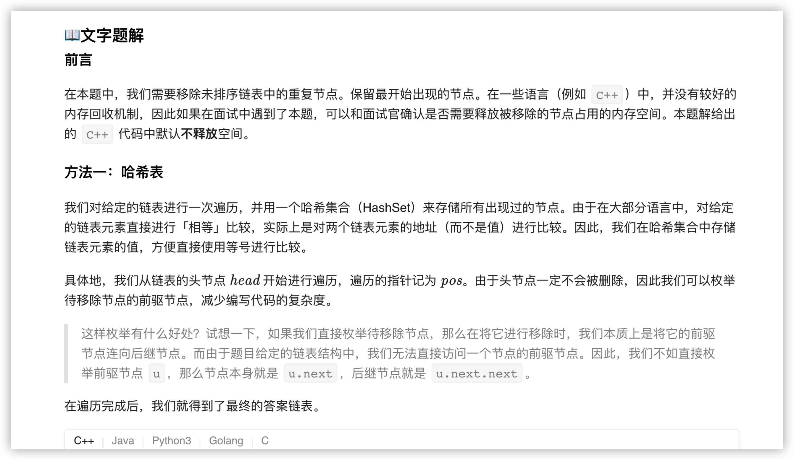
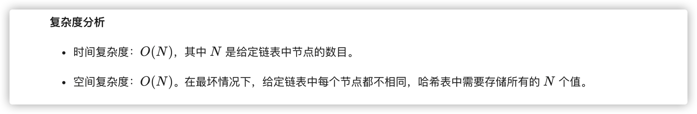
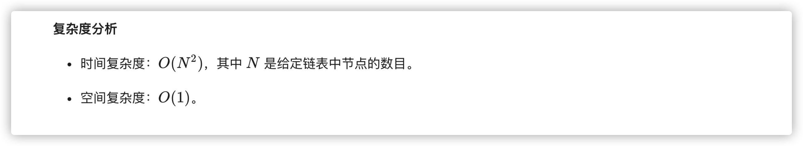

### 官方题解 [@link](https://leetcode-cn.com/problems/remove-duplicate-node-lcci/solution/yi-chu-zhong-fu-jie-dian-by-leetcode-solution/)


```Golang
func removeDuplicateNodes(head *ListNode) *ListNode {
    if head == nil {
        return head
    }
    occurred := map[int]bool{head.Val: true}
    pos := head
    for pos.Next != nil {
        cur := pos.Next
        if !occurred[cur.Val] {
            occurred[cur.Val] = true
            pos = pos.Next
        } else {
            pos.Next = pos.Next.Next
        }
    }
    pos.Next = nil
    return head
}
```


```Golang
func removeDuplicateNodes(head *ListNode) *ListNode {
    ob := head
    for ob != nil {
        oc := ob
        for oc.Next != nil {
            if oc.Next.Val == ob.Val {
                oc.Next = oc.Next.Next
            } else {
                oc = oc.Next
            }
        }
        ob = ob.Next
    }
    return head
}
```
