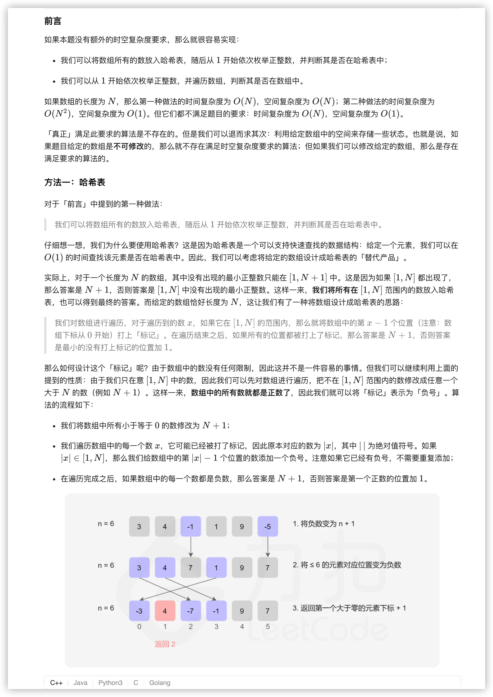
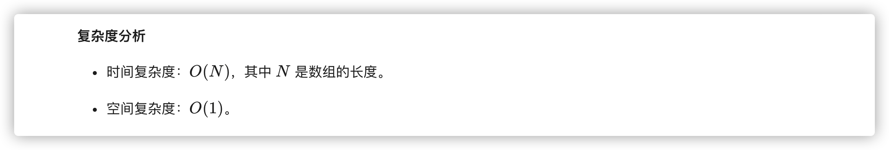
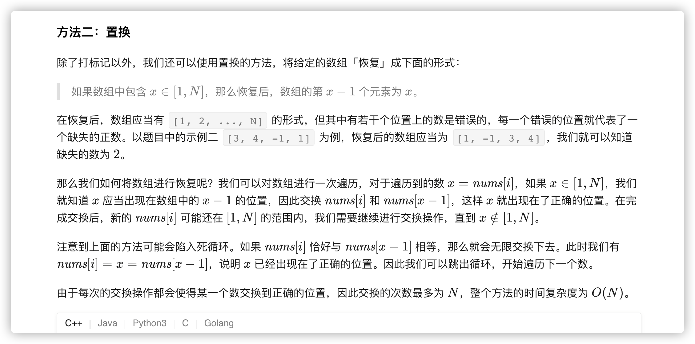
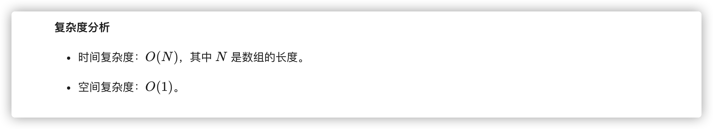

### 官方题解 [@link](https://leetcode-cn.com/problems/first-missing-positive/solution/que-shi-de-di-yi-ge-zheng-shu-by-leetcode-solution/)


```Golang
func firstMissingPositive(nums []int) int {
    n := len(nums)
    for i := 0; i < n; i++ {
        if nums[i] <= 0 {
            nums[i] = n + 1
        }
    }
    for i := 0; i < n; i++ {
        num := abs(nums[i])
        if num <= n {
            fmt.Println(num-1)
            nums[num - 1] = -abs(nums[num - 1])
        }
    }
    for i := 0; i < n; i++ {
        if nums[i] > 0 {
            return i + 1
        }
    }
    return n + 1
}

func abs(x int) int {
    if x < 0 {
        return -x
    }
    return x
}
```


```Golang
func firstMissingPositive(nums []int) int {
    n := len(nums)
    for i := 0; i < n; i++ {
        for nums[i] > 0 && nums[i] <= n && nums[nums[i]-1] != nums[i] {
            nums[nums[i]-1], nums[i] = nums[i], nums[nums[i]-1]
        }
    }
    for i := 0; i < n; i++ {
        if nums[i] != i + 1 {
            return i + 1
        }
    }
    return n + 1
}
```
