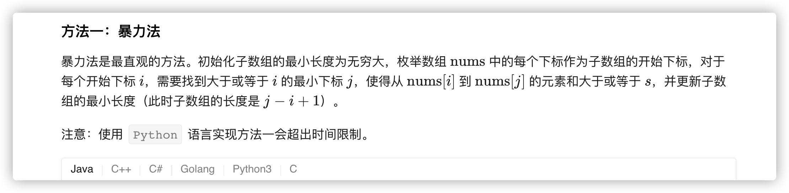
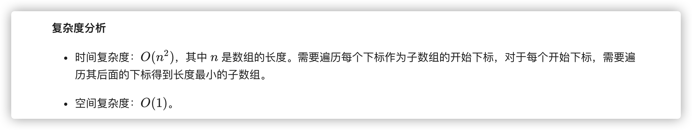
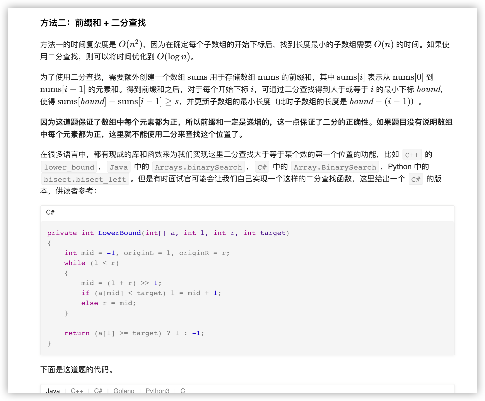
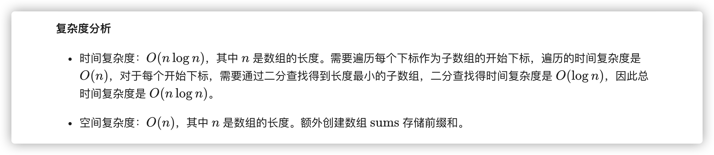
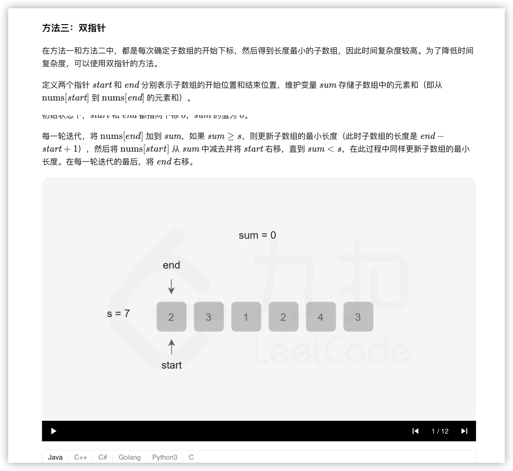
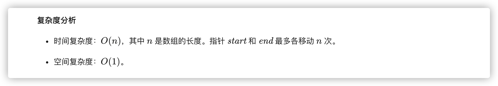

### 官方题解 [@link](https://leetcode-cn.com/problems/minimum-size-subarray-sum/solution/chang-du-zui-xiao-de-zi-shu-zu-by-leetcode-solutio/)


```Golang
func minSubArrayLen(s int, nums []int) int {
    n := len(nums)
    if n == 0 {
        return 0
    }
    ans := math.MaxInt32
    for i := 0; i < n; i++ {
        sum := 0
        for j := i; j < n; j++ {
            sum += nums[j]
            if sum >= s {
                ans = min(ans, j - i + 1)
                break
            }
        }
    }
    if ans == math.MaxInt32 {
        return 0
    }
    return ans
}

func min(x, y int) int {
    if x < y {
        return x
    }
    return y
}
```


```Golang
func minSubArrayLen(s int, nums []int) int {
    n := len(nums)
    if n == 0 {
        return 0
    }
    ans := math.MaxInt32
    sums := make([]int, n + 1)
    // 为了方便计算，令 size = n + 1 
    // sums[0] = 0 意味着前 0 个元素的前缀和为 0
    // sums[1] = A[0] 前 1 个元素的前缀和为 A[0]
    // 以此类推
    for i := 1; i <= n; i++ {
        sums[i] = sums[i - 1] + nums[i - 1]
    }
    for i := 1; i <= n; i++ {
        target := s + sums[i-1]
        bound := sort.SearchInts(sums, target)
        if bound < 0 {
            bound = -bound - 1
        }
        if bound <= n {
            ans = min(ans, bound - (i - 1))
        }
    }
    if ans == math.MaxInt32 {
        return 0
    }
    return ans
}

func min(x, y int) int {
    if x < y {
        return x
    }
    return y
}
```


```Golang
func minSubArrayLen(s int, nums []int) int {
    n := len(nums)
    if n == 0 {
        return 0
    }
    ans := math.MaxInt32
    start, end := 0, 0
    sum := 0
    for end < n {
        sum += nums[end]
        for sum >= s {
            ans = min(ans, end - start + 1)
            sum -= nums[start]
            start++
        }
        end++
    }
    if ans == math.MaxInt32 {
        return 0
    }
    return ans
}

func min(x, y int) int {
    if x < y {
        return x
    }
    return y
}
```
