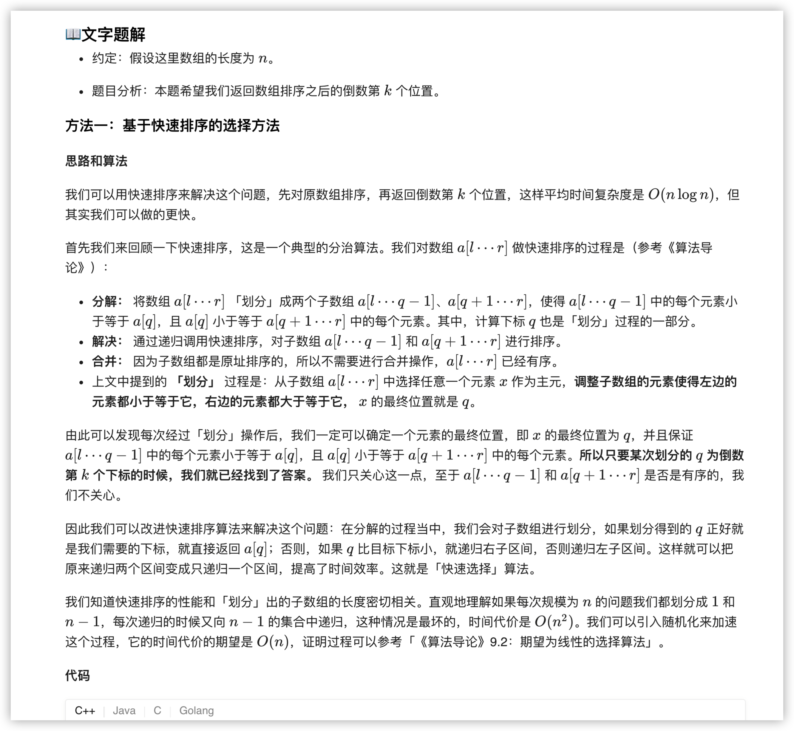
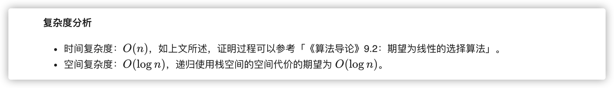
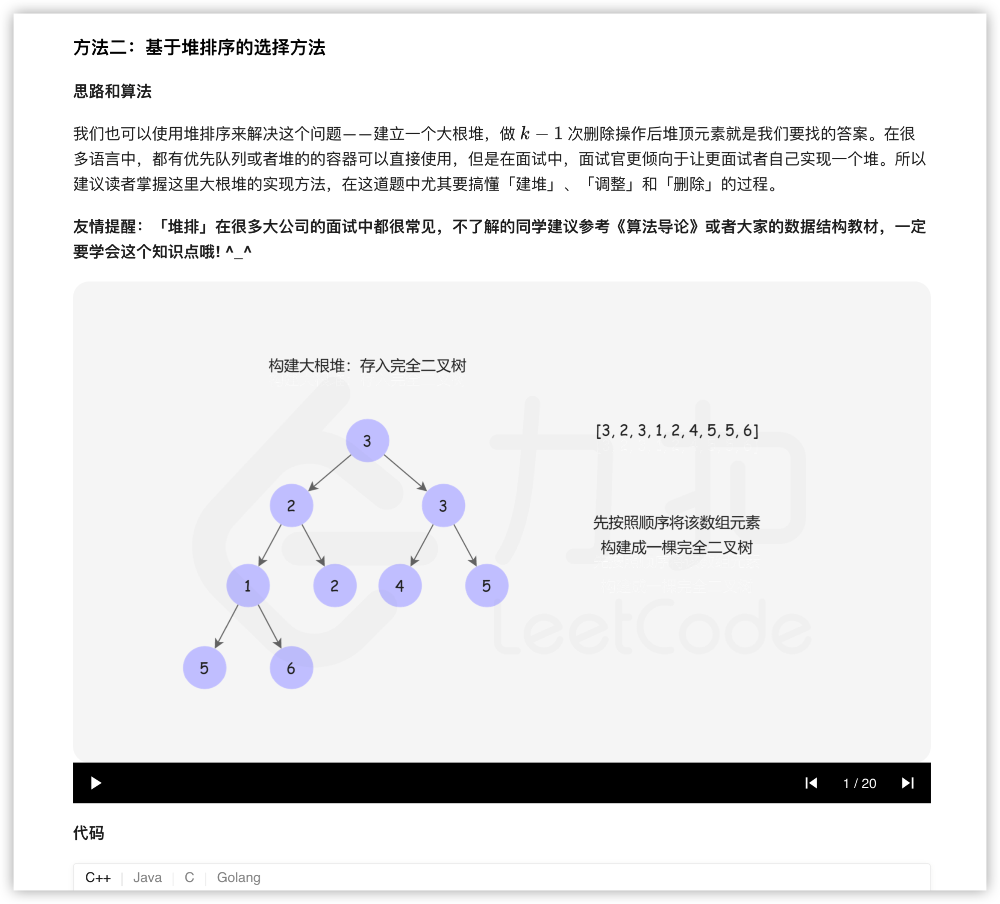

### 官方题解 [@link](https://leetcode-cn.com/problems/kth-largest-element-in-an-array/solution/shu-zu-zhong-de-di-kge-zui-da-yuan-su-by-leetcode-/)


```Golang
func findKthLargest(nums []int, k int) int {
    rand.Seed(time.Now().UnixNano())
    return quickSelect(nums, 0, len(nums)-1, len(nums)-k)
}

func quickSelect(a []int, l, r, index int) int {
    q := randomPartition(a, l, r)
    if q == index {
        return a[q]
    } else if q < index {
        return quickSelect(a, q + 1, r, index)
    }
    return quickSelect(a, l, q - 1, index)
}

func randomPartition(a []int, l, r int) int {
    i := rand.Int() % (r - l + 1) + l
    a[i], a[r] = a[r], a[i]
    return partition(a, l, r)
}

func partition(a []int, l, r int) int {
    x := a[r]
    i := l - 1
    for j := l; j < r; j++ {
        if a[j] <= x {
            i++
            a[i], a[j] = a[j], a[i]
        }
    }
    a[i+1], a[r] = a[r], a[i+1]
    return i + 1
}
```


```Golang
func findKthLargest(nums []int, k int) int {
    heapSize := len(nums)
    buildMaxHeap(nums, heapSize)
    for i := len(nums) - 1; i >= len(nums) - k + 1; i-- {
        nums[0], nums[i] = nums[i], nums[0]
        heapSize--
        maxHeapify(nums, 0, heapSize)
    }
    return nums[0]
}

func buildMaxHeap(a []int, heapSize int) {
    for i := heapSize/2; i >= 0; i-- {
        maxHeapify(a, i, heapSize)
    }
}

func maxHeapify(a []int, i, heapSize int) {
    l, r, largest := i * 2 + 1, i * 2 + 2, i
    if l < heapSize && a[l] > a[largest] {
        largest = l
    }
    if r < heapSize && a[r] > a[largest] {
        largest = r
    }
    if largest != i {
        a[i], a[largest] = a[largest], a[i]
        maxHeapify(a, largest, heapSize)
    }
}
```
