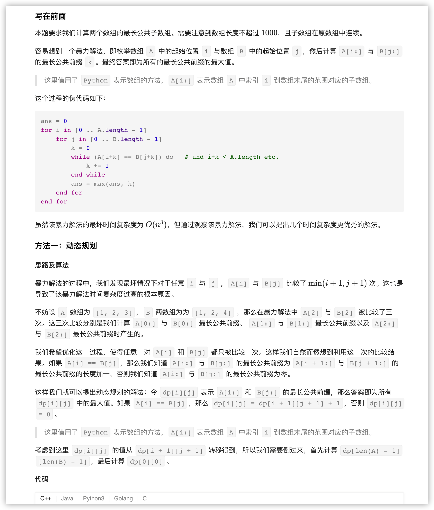

### 官方题解 [@link](https://leetcode-cn.com/problems/maximum-length-of-repeated-subarray/solution/zui-chang-zhong-fu-zi-shu-zu-by-leetcode-solution/)


```Golang
func findLength(A []int, B []int) int {
    n, m := len(A), len(B)
    dp := make([][]int, n + 1)
    for i := 0; i < len(dp); i++ {
        dp[i] = make([]int, m + 1)
    }
    ans := 0
    for i := n - 1; i >= 0; i-- {
        for j := m - 1; j >= 0; j-- {
            if A[i] == B[j] {
                dp[i][j] = dp[i + 1][j + 1] + 1
            } else {
                dp[i][j] = 0
            }
            if ans < dp[i][j] {
                ans = dp[i][j]
            }
        }
    }
    return ans
}
```


```Golang
func findLength(A []int, B []int) int {
    n, m := len(A), len(B)
    ret := 0
    for i := 0; i < n; i++ {
        len := min(m, n - i)
        maxLen := maxLength(A, B, i, 0, len)
        ret = max(ret, maxLen)
    }
    for i := 0; i < m; i++ {
        len := min(n, m - i)
        maxLen := maxLength(A, B, 0, i, len)
        ret = max(ret, maxLen)        
    }
    return ret
}

func maxLength(A, B []int, addA, addB, len int) int {
    ret, k := 0, 0
    for i := 0; i < len; i++ {
        if A[addA + i] == B[addB + i] {
            k++
        } else {
            k = 0
        }
        ret = max(ret, k)
    }
    return ret
}

func max(x, y int) int {
    if x > y {
        return x
    }
    return y
}

func min(x, y int) int {
    if x < y {
        return x
    }
    return y
}
```


```Golang
const (
    base, mod = 113, 1000000009
)

func findLength(A []int, B []int) int {
    check := func(length int) bool {
        hashA := 0
        for i := 0; i < length; i++ {
            hashA = (hashA * base + A[i]) % mod
        }
        bucketA := map[int]bool{hashA: true}
        mult := qPow(base, length - 1)
        for i := length; i < len(A); i++ {
            hashA = ((hashA - A[i - length] * mult % mod + mod) % mod * base + A[i]) % mod
            bucketA[hashA] = true
        }

        hashB := 0
        for i := 0; i < length; i++ {
            hashB = (hashB * base + B[i]) % mod
        }
        if bucketA[hashB] {
            return true
        }
        for i := length; i < len(B); i++ {
            hashB = ((hashB - B[i - length] * mult % mod + mod) % mod * base + B[i]) % mod
            if bucketA[hashB] {
                return true
            }
        }
        return false
    }

    left, right := 1, min(len(A), len(B)) + 1
    for left < right {
        mid := (left + right) >> 1
        if check(mid) {
            left = mid + 1
        } else {
            right = mid
        }
    }
    return left - 1
}
    
func qPow(x, n int) int {
    ret := 1
    for n != 0 {
        if n & 1 != 0 {
            ret = ret * x % mod
        }
        x = x * x % mod
        n >>= 1
    }
    return ret
}

func min(x, y int) int {
    if x < y {
        return x
    }
    return y
}
```
