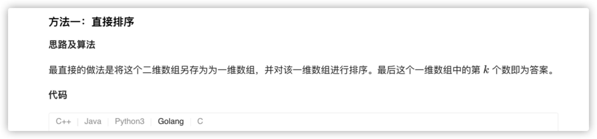

### 官方题解 [@link](https://leetcode-cn.com/problems/kth-smallest-element-in-a-sorted-matrix/solution/you-xu-ju-zhen-zhong-di-kxiao-de-yuan-su-by-leetco/)


```Golang
func kthSmallest(matrix [][]int, k int) int {
    rows, columns := len(matrix), len(matrix[0])
    sorted := make([]int, rows * columns)
    index := 0
    for _, row := range matrix {
        for _, num := range row {
            sorted[index] = num
            index++
        }
    }
    sort.Ints(sorted)
    return sorted[k-1]
}
```


```Golang
func kthSmallest(matrix [][]int, k int) int {
    h := &IHeap{}
    for i := 0; i < len(matrix); i++ {
        heap.Push(h, [3]int{matrix[i][0], i, 0})
    }

    for i := 0; i < k - 1; i++ {
        now := heap.Pop(h).([3]int)
        if now[2] != len(matrix) - 1 {
            heap.Push(h, [3]int{matrix[now[1]][now[2]+1], now[1], now[2]+1})
        }
    }
    return heap.Pop(h).([3]int)[0]
}

type IHeap [][3]int

func (h IHeap) Len() int           { return len(h) }
func (h IHeap) Less(i, j int) bool { return h[i][0] < h[j][0] }
func (h IHeap) Swap(i, j int)      { h[i], h[j] = h[j], h[i] }

func (h *IHeap) Push(x interface{}) {
	*h = append(*h, x.([3]int))
}

func (h *IHeap) Pop() interface{} {
	old := *h
	n := len(old)
	x := old[n-1]
	*h = old[0 : n-1]
	return x
}
```


```Golang
func kthSmallest(matrix [][]int, k int) int {
    n := len(matrix)
    left, right := matrix[0][0], matrix[n-1][n-1]
    for left < right {
        mid := left + (right - left) / 2
        if check(matrix, mid, k, n) {
            right = mid
        } else {
            left = mid + 1
        }
    }
    return left
}

func check(matrix [][]int, mid, k, n int) bool {
    i, j := n - 1, 0
    num := 0
    for i >= 0 && j < n {
        if matrix[i][j] <= mid {
            num += i + 1
            j++
        } else {
            i--
        }
    }
    return num >= k
}
```
