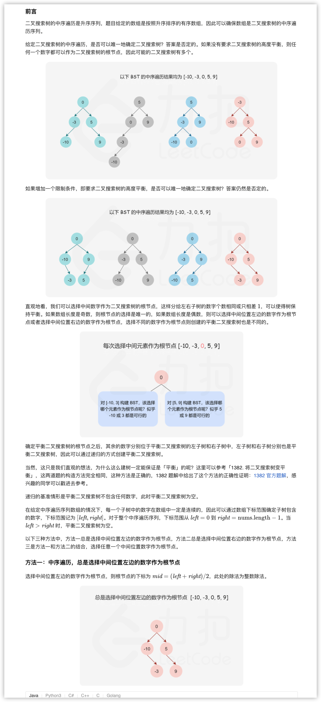
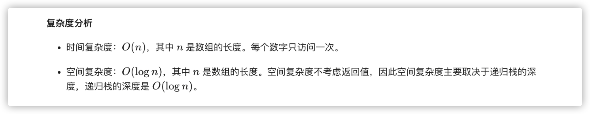
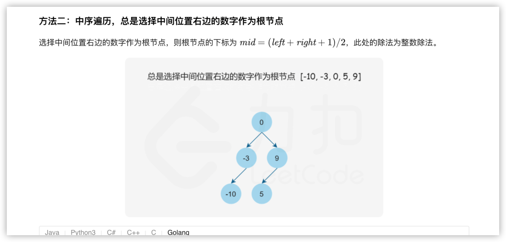
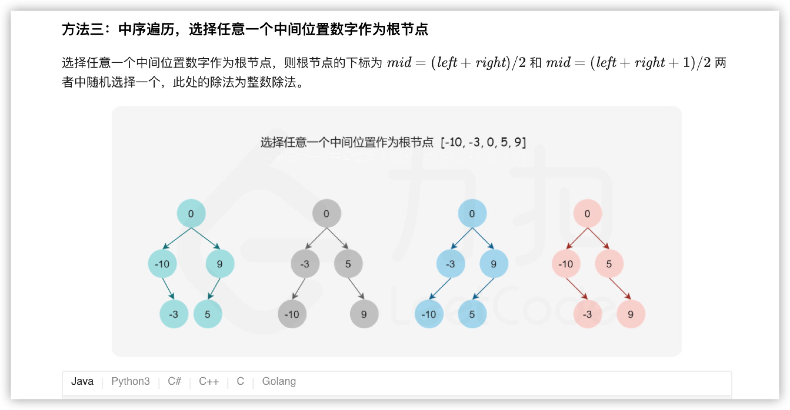
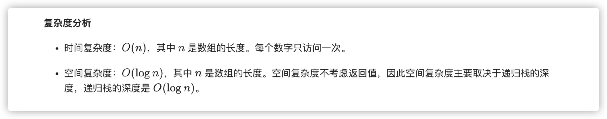

### 官方题解 [@link](https://leetcode-cn.com/problems/convert-sorted-array-to-binary-search-tree/solution/jiang-you-xu-shu-zu-zhuan-huan-wei-er-cha-sou-s-33/)


```Golang
func sortedArrayToBST(nums []int) *TreeNode {
    return helper(nums, 0, len(nums) - 1)
}

func helper(nums []int, left, right int) *TreeNode {
    if left > right {
        return nil
    }
    mid := (left + right) / 2
    root := &TreeNode{Val: nums[mid]}
    root.Left = helper(nums, left, mid - 1)
    root.Right = helper(nums, mid + 1, right)
    return root
}
```


```Golang
func sortedArrayToBST(nums []int) *TreeNode {
    return helper(nums, 0, len(nums) - 1)
}

func helper(nums []int, left, right int) *TreeNode {
    if left > right {
        return nil
    }

    // 总是选择中间位置右边的数字作为根节点
    mid := (left + right + 1) / 2
    root := &TreeNode{Val: nums[mid]}
    root.Left = helper(nums, left, mid - 1)
    root.Right = helper(nums, mid + 1, right)
    return root
}
```


```Golang
func sortedArrayToBST(nums []int) *TreeNode {
    rand.Seed(time.Now().UnixNano())
    return helper(nums, 0, len(nums) - 1)
}

func helper(nums []int, left, right int) *TreeNode {
    if left > right {
        return nil
    }

    // 选择任意一个中间位置数字作为根节点
    mid := (left + right + rand.Intn(2)) / 2
    root := &TreeNode{Val: nums[mid]}
    root.Left = helper(nums, left, mid - 1)
    root.Right = helper(nums, mid + 1, right)
    return root
}
```
