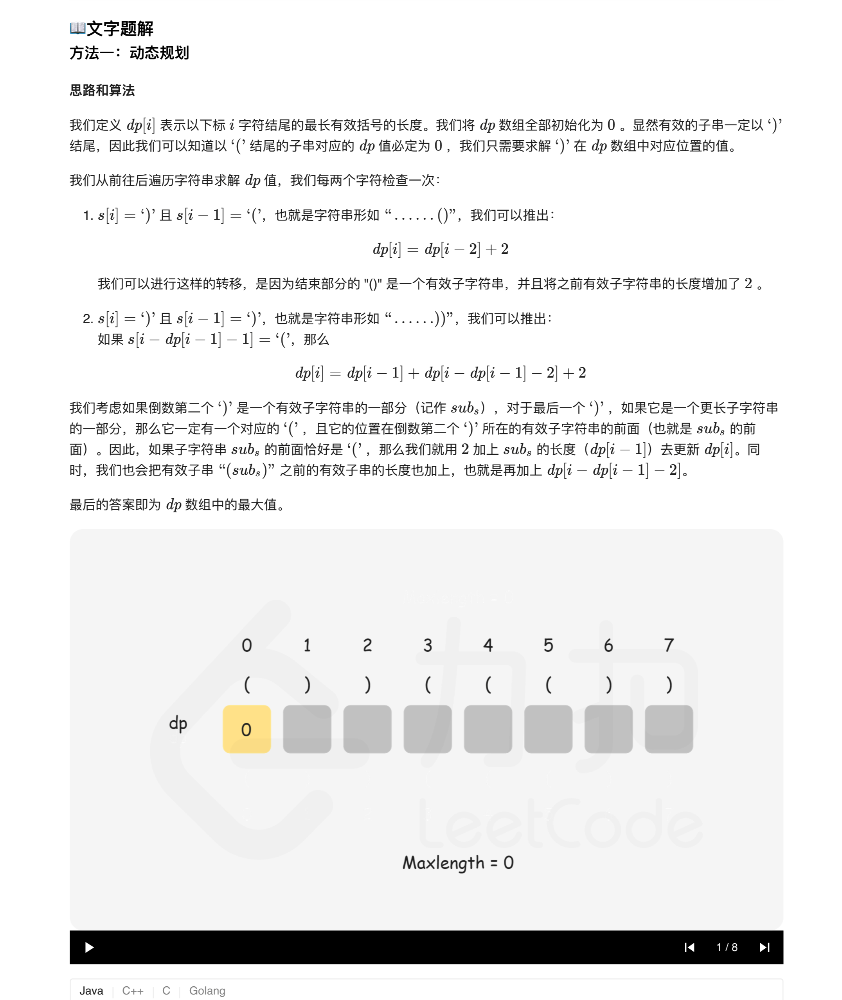
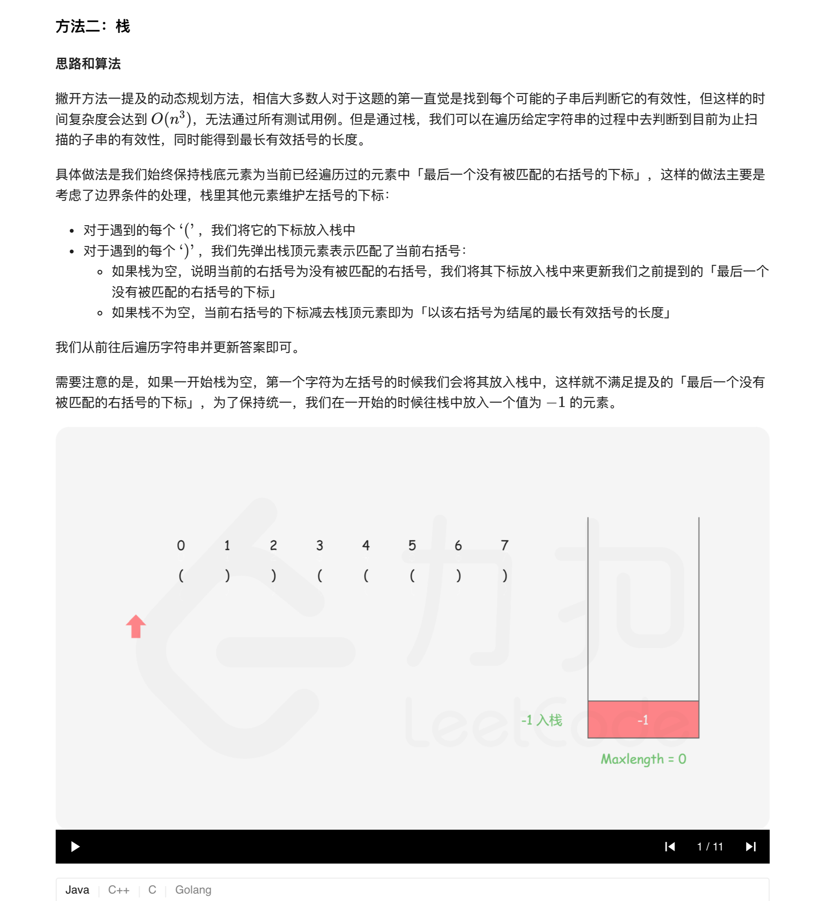

### 官方题解 [@link](https://leetcode-cn.com/problems/longest-valid-parentheses/solution/zui-chang-you-xiao-gua-hao-by-leetcode-solution/)


```Golang
func longestValidParentheses(s string) int {
    maxAns := 0
    dp := make([]int, len(s))
    for i := 1; i < len(s); i++ {
        if s[i] == ')' {
            if s[i-1] == '(' {
                if i >= 2 {
                    dp[i] = dp[i - 2] + 2
                } else {
                    dp[i] = 2
                }
            } else if i - dp[i - 1] > 0 && s[i - dp[i - 1] - 1] == '(' {
                if i - dp[i - 1] >= 2 {
                    dp[i] = dp[i - 1] + dp[i - dp[i - 1] - 2] + 2
                } else {
                    dp[i] = dp[i - 1] + 2
                }
            }
            maxAns = max(maxAns, dp[i])
        }
    }
    return maxAns
}

func max(x, y int) int {
    if x > y {
        return x
    }
    return y
}
```


```Golang
func longestValidParentheses(s string) int {
    maxAns := 0
    stack := []int{}
    stack = append(stack, -1)
    for i := 0; i < len(s); i++ {
        if s[i] == '(' {
            stack = append(stack, i)
        } else {
            stack = stack[:len(stack)-1]
            if len(stack) == 0 {
                stack = append(stack, i)
            } else {
                maxAns = max(maxAns, i - stack[len(stack)-1])
            }
        }
    }
    return maxAns
}

func max(x, y int) int {
    if x > y {
        return x
    }
    return y
}
```


```Golang
func longestValidParentheses(s string) int {
    left, right, maxLength := 0, 0, 0
    for i := 0; i < len(s); i++ {
        if s[i] == '(' {
            left++
        } else {
            right++
        }
        if left == right {
            maxLength = max(maxLength, 2 * right)
        } else if right > left {
            left, right = 0, 0
        }
    }
    left, right = 0, 0
    for i := len(s) - 1; i >= 0; i-- {
        if s[i] == '(' {
            left++
        } else {
            right++
        }
        if left == right {
            maxLength = max(maxLength, 2 * left)
        } else if left > right {
            left, right = 0, 0
        }
    }
    return maxLength
}

func max(x, y int) int {
    if x > y {
        return x
    }
    return y
}
```
