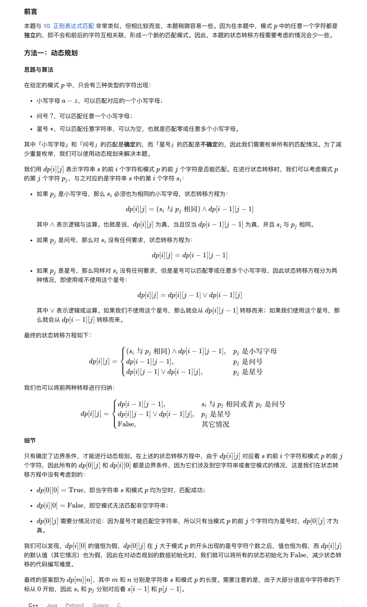
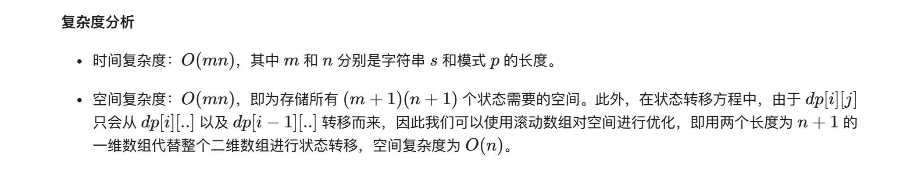
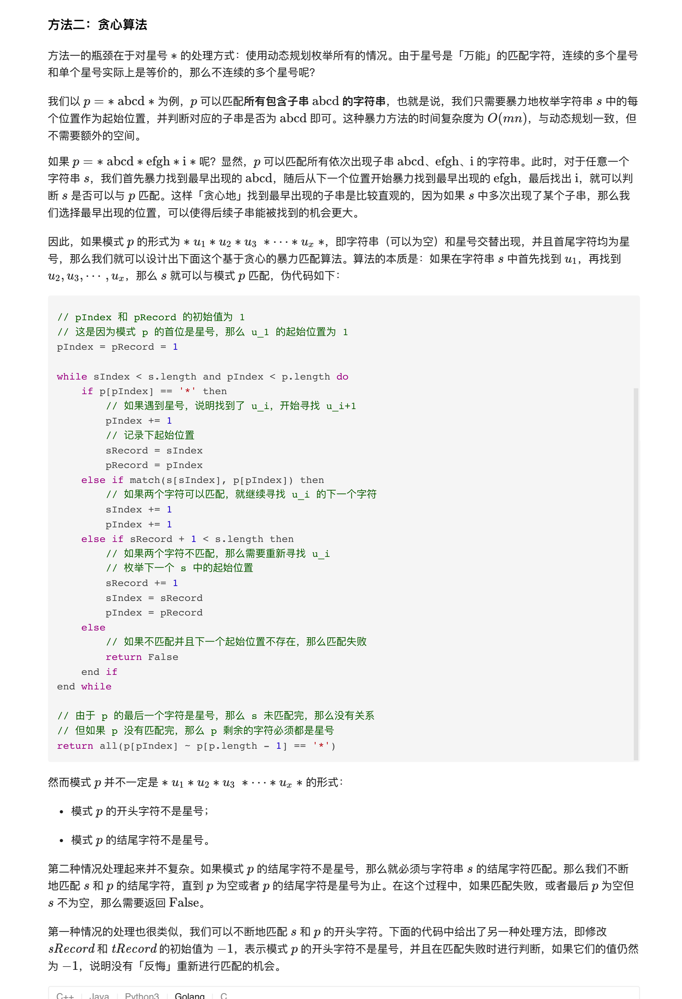
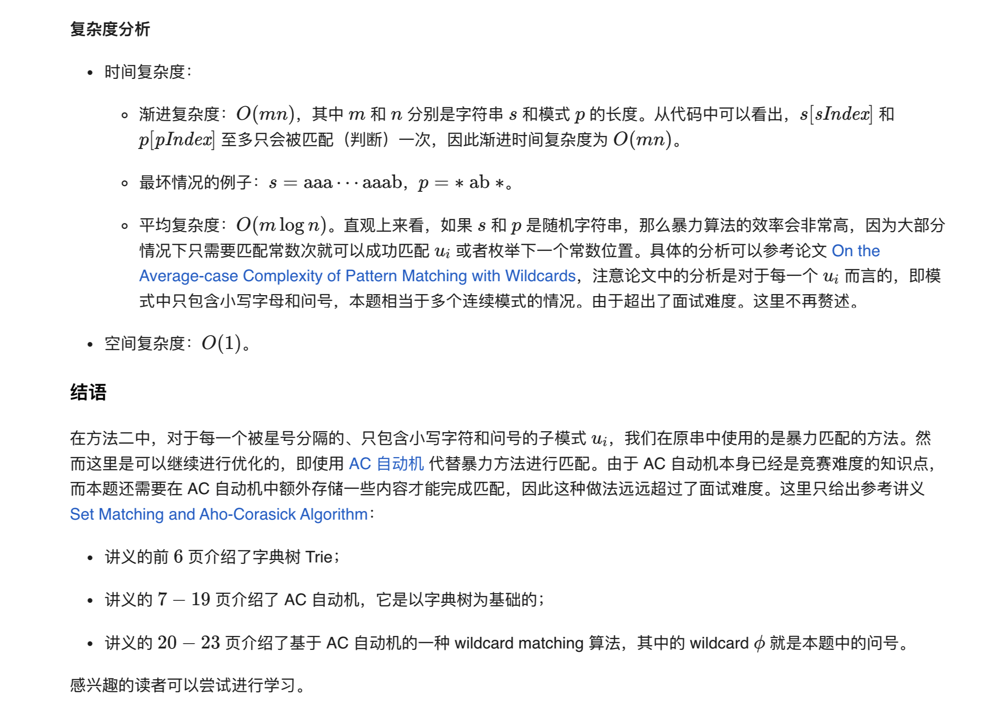

### 官方题解 [@link](https://leetcode-cn.com/problems/wildcard-matching/solution/tong-pei-fu-pi-pei-by-leetcode-solution/)


```Golang
func isMatch(s string, p string) bool {
    m, n := len(s), len(p)
    dp := make([][]bool, m + 1)
    for i := 0; i <= m; i++ {
        dp[i] = make([]bool, n + 1)
    }
    dp[0][0] = true
    for i := 1; i <= n; i++ {
        if p[i-1] == '*' {
            dp[0][i] = true
        } else {
            break
        }
    }
    for i := 1; i <= m; i++ {
        for j := 1; j <= n; j++ {
            if p[j-1] == '*' {
                dp[i][j] = dp[i][j-1] || dp[i-1][j]
            } else if p[j-1] == '?' || s[i-1] == p[j-1] {
                dp[i][j] = dp[i-1][j-1]
            }
        }
    }
    return dp[m][n]
}
```


```Golang
func isMatch(s string, p string) bool {
    for len(s) > 0 && len(p) > 0 && p[len(p)-1] != '*' {
        if charMatch(s[len(s)-1], p[len(p)-1]) {
            s = s[:len(s)-1]
            p = p[:len(p)-1]
        } else {
            return false
        }
    }
    if len(p) == 0 {
        return len(s) == 0
    }
    sIndex, pIndex := 0, 0
    sRecord, pRecord := -1, -1
    for sIndex < len(s) && pRecord < len(p) {
        if p[pIndex] == '*' {
            pIndex++
            sRecord, pRecord = sIndex, pIndex
        } else if charMatch(s[sIndex], p[pIndex]) {
            sIndex++
            pIndex++
        } else if sRecord != -1 && sRecord + 1 < len(s) {
            sRecord++
            sIndex, pIndex = sRecord, pRecord
        } else {
            return false
        }
    }
    return allStars(p, pIndex, len(p))
}

func allStars(str string, left, right int) bool {
    for i := left; i < right; i++ {
        if str[i] != '*' {
            return false
        }
    }
    return true
}

func charMatch(u, v byte) bool {
    return u == v || v == '?'
}
```
