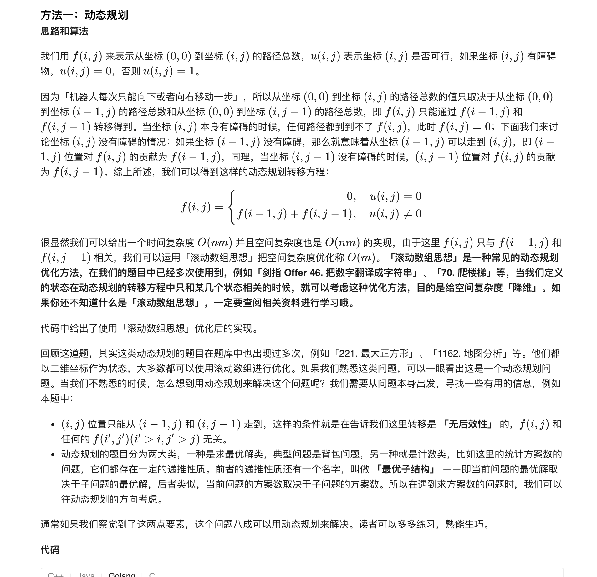

### 官方题解 [@link](https://leetcode-cn.com/problems/unique-paths-ii/solution/bu-tong-lu-jing-ii-by-leetcode-solution-2/)


```Golang
func uniquePathsWithObstacles(obstacleGrid [][]int) int {
    n, m := len(obstacleGrid), len(obstacleGrid[0])
    f := make([]int, m)
    if obstacleGrid[0][0] == 0 {
        f[0] = 1
    }
    for i := 0; i < n; i++ {
        for j := 0; j < m; j++ {
            if obstacleGrid[i][j] == 1 {
                f[j] = 0
                continue
            }
            if j - 1 >= 0 && obstacleGrid[i][j-1] == 0 {
                f[j] += f[j-1]
            }
        }
    }
    return f[len(f)-1]
}
```
