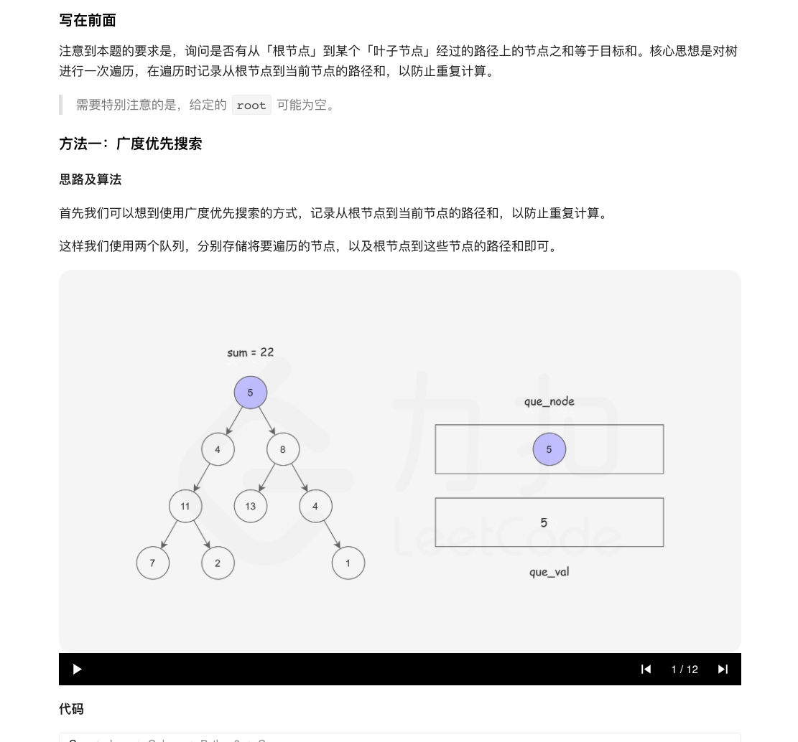
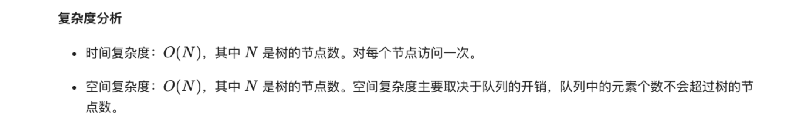
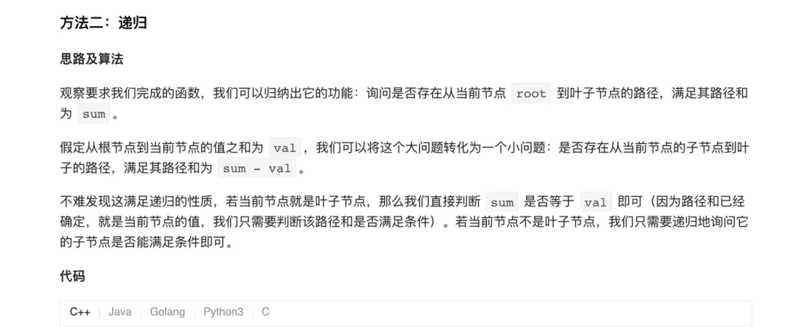
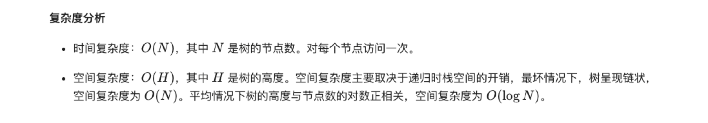

### 官方题解 [@link](https://leetcode-cn.com/problems/path-sum/solution/lu-jing-zong-he-by-leetcode-solution/)


```Golang
func hasPathSum(root *TreeNode, sum int) bool {
    if root == nil {
        return false
    }
    queNode := []*TreeNode{}
    queVal := []int{}
    queNode = append(queNode, root)
    queVal = append(queVal, root.Val)
    for len(queNode) != 0 {
        now := queNode[0]
        queNode = queNode[1:]
        temp := queVal[0]
        queVal = queVal[1:]
        if now.Left == nil && now.Right == nil {
            if temp == sum {
                return true
            }
            continue
        }
        if now.Left != nil {
            queNode = append(queNode, now.Left)
            queVal = append(queVal, now.Left.Val + temp)
        }
        if now.Right != nil {
            queNode = append(queNode, now.Right)
            queVal = append(queVal, now.Right.Val + temp)
        }
    }
    return false
}
```


```Golang
func hasPathSum(root *TreeNode, sum int) bool {
    if root == nil {
        return false
    }
    if root.Left == nil && root.Right == nil {
        return sum == root.Val
    }
    return hasPathSum(root.Left, sum - root.Val) || hasPathSum(root.Right, sum - root.Val)
}
```
