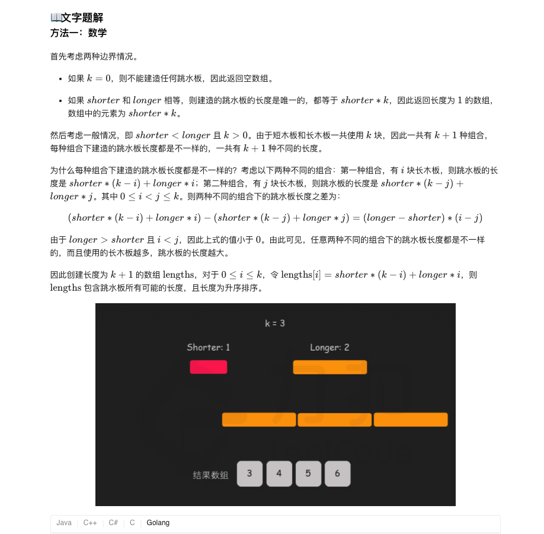
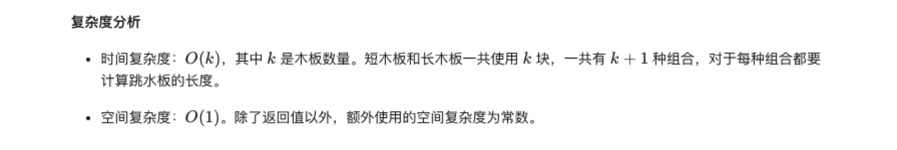

### 官方题解 [@link](https://leetcode-cn.com/problems/diving-board-lcci/solution/tiao-shui-ban-by-leetcode-solution/)


```Golang
func divingBoard(shorter int, longer int, k int) []int {
    if k == 0 {
        return []int{}
    }
    if shorter == longer {
        return []int{shorter * k}
    }
    lengths := make([]int, k + 1)
    for i := 0; i <= k; i++ {
        lengths[i] = shorter * (k - i) + longer * i
    }
    return lengths
}
```
